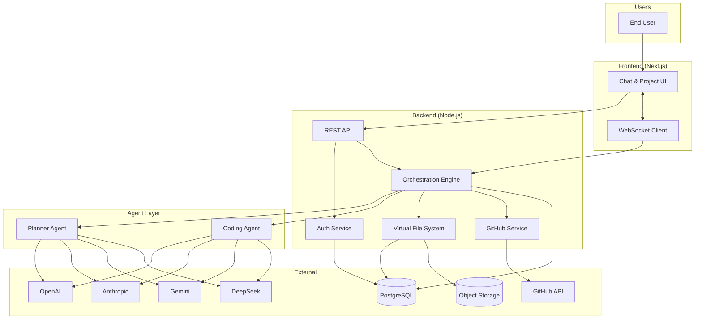

# Nebula AI — Architecture Overview

## System Context

## Phase 1 Scope

Phase 1 delivers the **orchestration engine** — the brain that connects user intent to agent execution:

| Feature | Description |
|---------|-------------|
| User Authentication | Email/password + OAuth, JWT sessions |
| Project Creation | Create, list, archive AI-generated projects |
| AI Chat Interface | Streaming chat with project context |
| Project Memory | Persistent conversation + file + task state |
| Planner Agent | Requirements → task breakdown → execution plan |
| Coding Agent | Code generation, modification, refactoring |
| File Storage | Virtual file system with versioning |
| GitHub Push | Create repo, commit, push generated code |

## Core Design Principles

1. **Event-driven orchestration** — Agent runs are async jobs with observable state transitions.
2. **Provider abstraction** — AI models are swappable via a unified `LLMProvider` interface.
3. **Immutable file versions** — Every agent write creates a new version; rollback is trivial.
4. **Idempotent GitHub ops** — Commits are keyed by `agent_run_id` to prevent duplicate pushes.
5. **Tenant isolation** — All queries scoped by `user_id`; projects are private by default.
6. **Fail-safe agents** — Timeouts, retries, cost limits, and human-in-the-loop checkpoints.

## Document Index

1. [Database Schema](./database-schema.md) — Tables, indexes, relationships
2. [Folder Structure](./folder-structure.md) — Monorepo layout
3. [API Design](./api-design.md) — REST endpoints, WebSocket events
4. [Frontend Architecture](./frontend-architecture.md) — Pages, state, components
5. [Backend Architecture](./backend-architecture.md) — Services, queues, middleware
6. [Agent Architecture](./agent-architecture.md) — Planner & Coding agent pipelines
7. [GitHub Integration](./github-integration.md) — OAuth, repo lifecycle
8. [Development Roadmap](./development-roadmap.md) — Phased delivery plan
