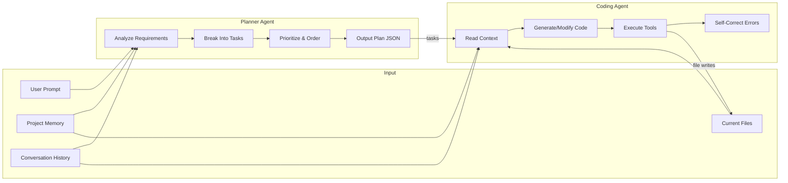
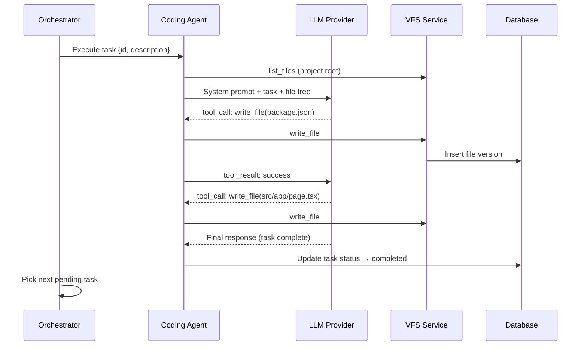

# Agent Architecture

## Overview

Nebula AI uses a **multi-agent system** with two primary agents in Phase 1. Agents are autonomous loops that call LLMs, execute tools, and produce structured output. The orchestration engine manages their lifecycle.



## Base Agent

All agents extend `BaseAgent`:

```typescript
abstract class BaseAgent {
  protected llm: LLMProvider;
  protected tools: ToolRegistry;
  protected context: AgentContext;

  abstract get systemPrompt(): string;
  abstract get agentType(): AgentType;

  async run(input: string): Promise<AgentResult> {
    const messages = this.buildMessages(input);
    let iterations = 0;
    const maxIterations = 25;

    while (iterations < maxIterations) {
      const response = await this.llm.chatComplete(messages, {
        tools: this.tools.getDefinitions(),
        temperature: this.getTemperature(),
      });

      if (response.toolCalls.length === 0) {
        return this.parseFinalResponse(response);
      }

      for (const call of response.toolCalls) {
        const result = await this.tools.execute(call);
        messages.push(toolResultMessage(call, result));
        await this.emitToolEvent(call, result);
      }

      iterations++;
    }

    throw new AgentMaxIterationsError(this.agentType);
  }
}
```

## Planner Agent

### Purpose

Transform a plain-English software description into a structured, prioritized execution plan.

### Input Context

| Source | Data |
|--------|------|
| User prompt | Original project description |
| User message | Follow-up instructions (if replanning) |
| Project memory | Existing requirements, tech decisions |
| Current tasks | Existing task tree (for incremental planning) |

### System Prompt Structure

```
You are the Planner Agent for Nebula AI.

ROLE: Analyze software requirements and produce actionable task plans.

OUTPUT FORMAT: JSON matching PlannerOutputSchema

RULES:
1. Break work into atomic tasks (1-3 files each)
2. Order tasks by dependency (scaffold → core → features → polish)
3. Assign priority: critical (blockers), high, medium, low
4. Estimate files each task will create/modify
5. Detect tech stack from requirements
6. Store architectural decisions in plan.architecture
```

### Output Schema (`plan_json`)

```typescript
interface PlannerOutput {
  summary: string;
  appType: string;                    // "food-delivery", "crm", "saas", "ecommerce"
  techStack: {
    frontend: string;                   // "nextjs"
    backend: string;                    // "nodejs" | "none"
    database: string;                   // "postgresql" | "sqlite" | "none"
    styling: string;                  // "tailwind"
    auth: string;                     // "nextauth" | "custom" | "none"
  };
  architecture: {
    description: string;
    components: string[];
    folderStructure: string[];
  };
  phases: Phase[];
  tasks: PlannedTask[];
}

interface Phase {
  name: string;                       // "Foundation", "Core Features", "Polish"
  description: string;
  taskIds: string[];
}

interface PlannedTask {
  id: string;                         // generated UUID
  title: string;
  description: string;
  priority: TaskPriority;
  phase: string;
  dependencies: string[];             // task IDs
  estimatedFiles: string[];
  acceptanceCriteria: string[];
}
```

### Tools Available

| Tool | Purpose |
|------|---------|
| `create_task` | Insert task into database |
| `update_memory` | Store tech decisions, requirements |
| `list_files` | Check existing project files (for replanning) |

### Post-Processing

After planner completes:
1. Parse `plan_json` from final response
2. Batch insert tasks via `TaskService`
3. Update `project_memory` with requirements, tech_decisions, architecture
4. Update `project.tech_stack` and `project.metadata`
5. Transition project status: `planning` → `building` (if mode is `full`)

---

## Coding Agent

### Purpose

Generate, modify, and refactor code files based on task definitions and project context.

### Input Context

| Source | Data |
|--------|------|
| Current task | Title, description, acceptance criteria, estimated files |
| Project memory | Tech stack, architecture, conventions |
| VFS snapshot | All current files (tree + contents) |
| Conversation | Recent user instructions |
| Dependencies | Output files from completed dependency tasks |

### System Prompt Structure

```
You are the Coding Agent for Nebula AI.

ROLE: Write production-quality code for the current task.

CONTEXT:
- Tech stack: {from memory}
- Architecture: {from memory}
- Current task: {task.title} — {task.description}
- Acceptance criteria: {task.acceptanceCriteria}

RULES:
1. Write complete, runnable code (no placeholders or TODOs)
2. Follow conventions from project memory
3. One file per tool call when possible
4. Import paths must be valid relative to project structure
5. If modifying existing files, read them first
6. Match existing code style in the project
```

### Tools Available

| Tool | Purpose | Parameters |
|------|---------|------------|
| `read_file` | Read file content | `path` |
| `write_file` | Create or update file | `path`, `content` |
| `delete_file` | Remove file | `path` |
| `list_files` | List directory contents | `path?`, `depth?` |
| `search_files` | Grep across project | `pattern`, `path?` |

### Execution Loop (Per Task)



### Self-Correction

If the coding agent detects issues (via a future `run_command` tool in Phase 2), it can:
1. Read error output
2. Modify the offending file
3. Re-validate

Phase 1 limits self-correction to LLM reasoning without execution.

### Task Execution Order

```
1. TaskService.getNextTask(projectId)
   → pending task with all dependencies completed
   → sorted by priority (critical first), then sort_order
2. Set task status → in_progress
3. Run coding agent with task context
4. On success: task → completed
5. On failure: task → blocked, agent run → failed
6. Repeat until no pending tasks
```

---

## Tool Registry

Central registry mapping tool names to implementations:

```typescript
class ToolRegistry {
  private tools: Map<string, Tool>;

  register(tool: Tool): void;
  getDefinitions(): ToolDefinition[];   // for LLM function calling
  async execute(call: ToolCall): Promise<ToolResult>;
}

interface Tool {
  name: string;
  description: string;
  parameters: JSONSchema;
  execute(args: Record<string, unknown>, ctx: ToolContext): Promise<ToolResult>;
}

interface ToolContext {
  projectId: string;
  agentRunId: string;
  userId: string;
  vfs: VFSService;
  memory: MemoryService;
  tasks: TaskService;
}
```

### Tool Result Format

```json
{
  "success": true,
  "output": "File written: src/app/page.tsx (1.2 KB)",
  "metadata": { "path": "src/app/page.tsx", "version": 1 }
}
```

---

## Agent Chaining

Agents chain via `parent_run_id`:

```
Agent Run 1: planner (parent: null)
  → creates tasks
Agent Run 2: coding-task-1 (parent: run-1)
  → writes scaffold files
Agent Run 3: coding-task-2 (parent: run-1)
  → writes auth module
...
Agent Run N: coding-task-N (parent: run-1)
  → final feature
```

The orchestrator enqueues coding runs sequentially (respecting task dependencies). Future phases may parallelize independent tasks.

---

## Context Window Management

Agents can exceed LLM context limits on large projects. Strategy:

| Priority | Content | Truncation |
|----------|---------|------------|
| 1 (never drop) | System prompt, current task | — |
| 2 | Project memory (tech_decisions, conventions) | Summarize if > 2K tokens |
| 3 | Current task files (estimated_files) | Full content |
| 4 | Conversation history | Last 10 messages |
| 5 | Full file tree | Tree only, no content |
| 6 | Other files | Excluded; agent uses `read_file` tool |

`ContextBuilder` assembles this hierarchy before each agent run.

---

## Cost Controls

| Limit | Default | Configurable |
|-------|---------|-------------|
| Max tokens per agent run | 100,000 | Per project |
| Max agent iterations | 25 | Per agent type |
| Max cost per project | $5.00 | Per user tier |
| Max concurrent agent runs | 3 | System-wide |

Exceeded limits → agent run status `failed` with `COST_LIMIT_EXCEEDED`.

---

## Future Agents (Phase 2+)

| Agent | Purpose |
|-------|---------|
| Reviewer | Code review, security checks, best practices |
| Debugger | Run tests, fix errors, iterate |
| Designer | UI/UX decisions, component library selection |
| DevOps | CI/CD, deployment configuration |
