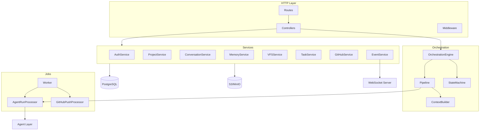
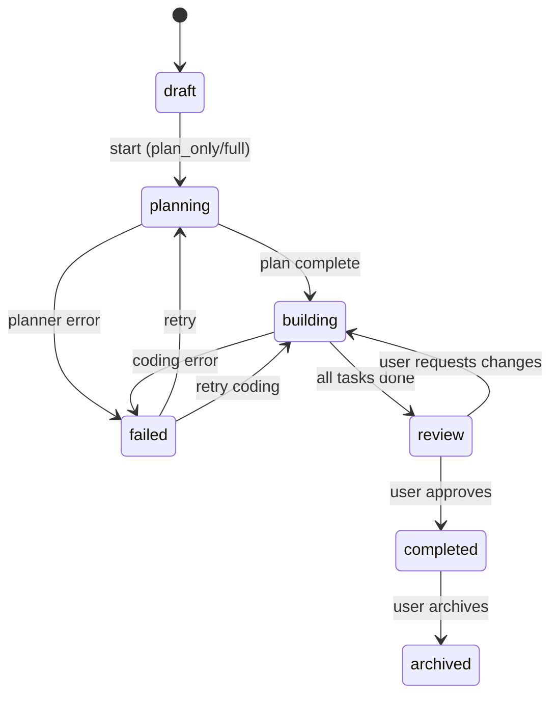

# Backend Architecture

## Overview

Node.js API server built on **Fastify** for performance, with **BullMQ** (Redis) for async agent execution and **Prisma** for PostgreSQL access. The orchestration engine is the central coordinator.

## Service Layer



## Orchestration Engine

The heart of Phase 1. Responsibilities:

1. Accept user intent (project creation, chat message, manual start)
2. Determine which agent(s) to invoke
3. Build context from project memory, files, tasks, conversation
4. Enqueue agent runs on BullMQ
5. Process agent tool calls (file writes, task creation)
6. Transition project status via state machine
7. Emit events for WebSocket clients

### `OrchestrationEngine`

```typescript
class OrchestrationEngine {
  async startProject(projectId: string, options: StartOptions): Promise<AgentRun>;
  async handleUserMessage(conversationId: string, content: string): Promise<AgentRun>;
  async processAgentCompletion(runId: string): Promise<void>;
  async cancelRun(runId: string): Promise<void>;
}
```

### Pipeline Modes

| Mode | Flow |
|------|------|
| `full` | Planner → (user review optional) → Coding (per task) → GitHub push |
| `plan_only` | Planner only |
| `code_only` | Coding agent on pending tasks |

### Project State Machine



## Service Details

### `AuthService`

- bcrypt password hashing (cost factor 12)
- JWT generation (RS256, 24h expiry, refresh via session table)
- OAuth token exchange (Google, GitHub)
- Session invalidation on logout

### `ProjectService`

- CRUD with user scoping
- Slug generation from name (unique per user)
- Status transitions validated by state machine
- Soft delete via `archived_at`

### `MemoryService`

- Read/write `project_memory` key-value store
- Merges planner output into structured memory
- Builds context window for agents (truncates to token budget)
- Keys: `requirements`, `tech_decisions`, `architecture`, `conventions`, `user_preferences`

### `VFSService` (Virtual File System)

```typescript
interface VFSService {
  listTree(projectId: string, path?: string, depth?: number): FileNode[];
  readFile(projectId: string, path: string, version?: number): FileContent;
  writeFile(projectId: string, path: string, content: string, agentRunId?: string): File;
  deleteFile(projectId: string, path: string, agentRunId?: string): void;
  getHistory(projectId: string, path: string): FileVersion[];
  getSnapshot(projectId: string): Map<string, string>;  // for GitHub push
}
```

**Versioning rules:**
- Every write creates a new row with `version + 1`
- Previous version linked via `parent_version_id`
- Soft delete sets `is_deleted = true` (preserves history)
- Content dedup via `content_hash` (optional optimization)
- Files > 1MB stored in S3; metadata in PostgreSQL

### `TaskService`

- CRUD for planner-generated tasks
- Topological sort by `dependencies` for execution order
- Status transitions: `pending` → `in_progress` → `completed`
- Batch insert from planner `plan_json`

### `EventService`

- Writes to `orchestration_events` table
- Publishes to WebSocket subscribers for the project
- Event types defined in `packages/shared/constants/events.ts`

### `GitHubService`

- Manages `github_connections` per user
- Creates repos via GitHub App installation token
- Builds git tree from VFS snapshot, commits, pushes
- See [GitHub Integration](./github-integration.md)

## Job Queue (BullMQ)

### Queues

| Queue | Concurrency | Purpose |
|-------|-------------|---------|
| `agent-runs` | 3 per worker | Execute planner/coding agents |
| `github-push` | 2 | Async repo creation and push |
| `cleanup` | 1 | Prune old file versions, events |

### `AgentRunProcessor`

```
1. Load agent_run + project context
2. Set status → running
3. Emit agent.run.started
4. Instantiate agent (planner | coding)
5. Run agent loop (LLM → tool calls → repeat)
6. On completion: set status → completed, emit event
7. On failure: retry up to max_retries, then → failed
8. Call OrchestrationEngine.processAgentCompletion()
```

### Retry Policy

- Exponential backoff: 5s, 30s, 120s
- Retry on: LLM timeout, rate limit (429), transient network
- No retry on: validation errors, auth failures, user cancellation

## Middleware Stack

```
Request
  → CORS
  → Rate Limiter (Redis-backed)
  → Request ID (correlation)
  → Auth (JWT verification)
  → User Scoping (attach userId)
  → Controller
  → Error Handler (standardized JSON errors)
```

## LLM Provider Layer

Unified interface in `apps/api/src/llm/`:

```typescript
interface LLMProvider {
  readonly name: string;
  chat(messages: Message[], options: ChatOptions): AsyncIterable<ChatChunk>;
  chatComplete(messages: Message[], options: ChatOptions): Promise<ChatResponse>;
  countTokens(text: string): number;
}
```

| Provider | Default Model | Use Case |
|----------|--------------|----------|
| Anthropic | claude-sonnet-4-20250514 | Planner (default) |
| OpenAI | gpt-4o | Coding alternative |
| Google | gemini-2.0-flash | Fast iteration |
| DeepSeek | deepseek-coder | Code-focused tasks |

**Provider selection:** Per-project `llm_provider` + `llm_model`. Fallback chain if primary fails.

## Configuration

```typescript
// config/env.ts — Zod validated
const envSchema = z.object({
  DATABASE_URL: z.string().url(),
  REDIS_URL: z.string().url(),
  S3_ENDPOINT: z.string().url(),
  S3_BUCKET: z.string(),
  JWT_SECRET: z.string().min(32),
  OPENAI_API_KEY: z.string().optional(),
  ANTHROPIC_API_KEY: z.string().optional(),
  GOOGLE_AI_API_KEY: z.string().optional(),
  DEEPSEEK_API_KEY: z.string().optional(),
  GITHUB_APP_ID: z.string(),
  GITHUB_APP_PRIVATE_KEY: z.string(),
  GITHUB_CLIENT_ID: z.string(),
  GITHUB_CLIENT_SECRET: z.string(),
});
```

## Security

| Concern | Mitigation |
|---------|------------|
| Tenant isolation | All queries filter by `user_id` |
| JWT | RS256, short-lived, httpOnly cookie |
| OAuth tokens | AES-256-GCM encrypted at rest |
| File path traversal | Normalize paths, reject `..` |
| LLM prompt injection | System prompt hardening, tool call validation |
| Rate limiting | Per-user Redis counters |
| Input validation | Zod schemas on all endpoints |

## Observability

| Signal | Tool |
|--------|------|
| Logs | Pino (structured JSON) |
| Metrics | Prometheus (request latency, agent duration, token usage) |
| Traces | OpenTelemetry (agent run spans) |
| Alerts | Agent failure rate > 10%, queue depth > 100 |

## Deployment

```
┌─────────────┐     ┌─────────────┐     ┌─────────────┐
│  Next.js    │────▶│  Fastify    │────▶│  PostgreSQL │
│  (Vercel)   │     │  (Fly.io)   │     │  (Neon)     │
└─────────────┘     └──────┬──────┘     └─────────────┘
                           │
                    ┌──────┴──────┐
                    │  BullMQ     │
                    │  Worker     │
                    │  (Fly.io)   │
                    └──────┬──────┘
                           │
              ┌────────────┼────────────┐
              ▼            ▼            ▼
          Redis        S3/MinIO     GitHub API
```

- API and Worker are separate processes (same codebase, different entry points)
- WebSocket runs on the API process (sticky sessions via load balancer)
- Horizontal scaling: add worker replicas for agent concurrency
