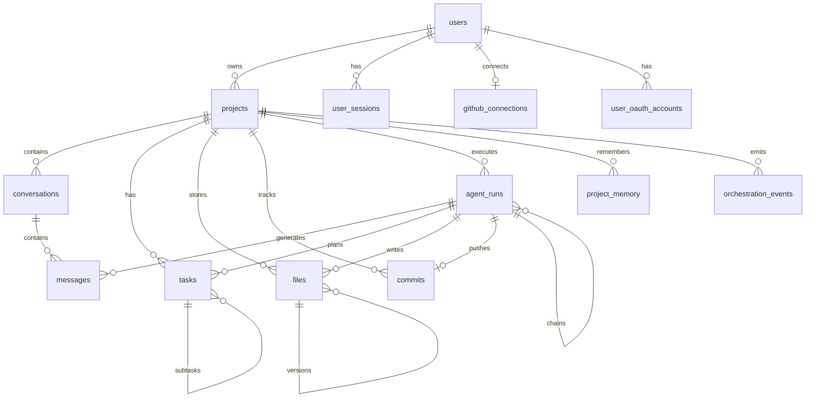

# Database Schema

## Entity Relationship Diagram



## Core Tables

### `users`

Authentication identity. Supports email/password and OAuth (Google, GitHub).

| Column | Type | Notes |
|--------|------|-------|
| `id` | UUID | Primary key |
| `email` | CITEXT | Unique, case-insensitive |
| `password_hash` | TEXT | bcrypt; NULL for OAuth-only |
| `role` | ENUM | `user` \| `admin` |

### `projects`

A software project the user wants built. Central entity for all orchestration.

| Column | Type | Notes |
|--------|------|-------|
| `prompt` | TEXT | Original plain-English request |
| `status` | ENUM | Lifecycle: `draft` → `planning` → `building` → `completed` |
| `tech_stack` | JSONB | e.g. `["nextjs", "postgresql", "tailwind"]` |
| `metadata` | JSONB | App type, features, constraints |
| `github_repo_url` | TEXT | Set after first GitHub push |

**Status transitions:**

```
draft → planning → building → review → completed
                  ↘ failed ↗        ↘ archived
```

### `conversations` + `messages`

Chat history scoped to a project. Messages link to `agent_runs` when generated by agents.

| `message_role` | Purpose |
|----------------|---------|
| `user` | User input |
| `assistant` | Agent/LLM response |
| `system` | System prompts, context injection |
| `tool` | Tool call results (file writes, etc.) |

### `tasks`

Planner Agent output. Hierarchical task tree with dependencies.

```json
{
  "title": "Create authentication module",
  "priority": "high",
  "dependencies": ["uuid-of-setup-task"],
  "estimated_files": ["src/auth/login.ts", "src/auth/register.ts"]
}
```

### `files`

Virtual file system with immutable versioning.

- **Active file:** `is_deleted = false`, unique per `(project_id, path)`
- **Version chain:** `parent_version_id` links to previous version
- **Large files:** `content` is NULL; `storage_key` points to S3

### `commits`

Tracks GitHub sync state per agent run. Idempotent via unique index on `agent_run_id`.

### `agent_runs`

**Orchestration core.** Every agent invocation is recorded here.

| Field | Purpose |
|-------|---------|
| `plan_json` | Structured planner output |
| `tool_calls` | Audit trail of VFS/GitHub operations |
| `parent_run_id` | Chains planner → coding → review |
| `tokens_*` / `cost_usd` | Usage tracking |

### `project_memory`

Key-value store for cross-session context:

| Key | Example Value |
|-----|---------------|
| `requirements` | Parsed feature list |
| `tech_decisions` | `{ "db": "postgresql", "auth": "jwt" }` |
| `architecture` | Component diagram, folder structure |
| `user_preferences` | `{ "styling": "tailwind", "dark_mode": true }` |

### `orchestration_events`

Append-only event log for WebSocket streaming and audit:

```
task.created, task.started, task.completed
file.created, file.updated, file.deleted
agent.run.started, agent.run.completed, agent.run.failed
commit.pushed, github.repo.created
```

## Indexes Strategy

| Pattern | Index |
|---------|-------|
| User's projects | `(user_id)` |
| Active agent runs | `(status) WHERE status IN ('queued', 'running')` |
| Chat history | `(conversation_id, created_at)` |
| File lookup | `(project_id, path) WHERE is_deleted = false` |
| Event stream | `(project_id, created_at DESC)` |

## Data Retention

| Data | Retention |
|------|-----------|
| Active projects | Indefinite |
| Archived projects | 90 days, then soft-delete |
| Agent runs | 1 year |
| Orchestration events | 30 days (archive to cold storage) |
| File versions | Keep last 50 per path; prune older |

## SQL File

Full DDL: [`packages/database/schema.sql`](../../packages/database/schema.sql)

## Prisma Mapping

During implementation, generate Prisma schema from this SQL. Key conventions:

- All IDs are UUID v4
- Timestamps are `TIMESTAMPTZ` (UTC)
- JSONB for flexible metadata; validate at application layer with Zod
- Encrypt `access_token`, `refresh_token`, `password_hash` at rest
