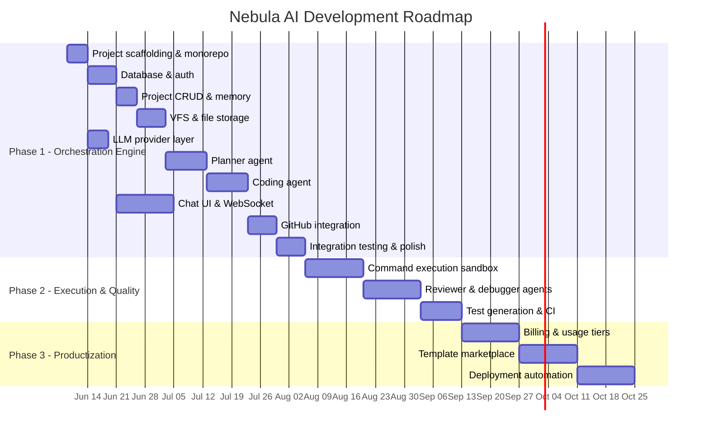

# Development Roadmap

## Phase Overview

---

## Phase 1: Orchestration Engine (Current)

**Goal:** User describes software → platform plans, codes, and pushes to GitHub.

**Duration:** ~10 weeks

### Sprint 1: Foundation (Week 1–2)

| Task | Priority | Deliverable |
|------|----------|-------------|
| Initialize pnpm monorepo with Turborepo | P0 | `package.json`, `turbo.json`, workspace config |
| Docker Compose (PostgreSQL, Redis, MinIO) | P0 | `infrastructure/docker-compose.yml` |
| Prisma schema from SQL DDL | P0 | `packages/database/prisma/schema.prisma` |
| Fastify app skeleton with health routes | P0 | `apps/api` boots and connects to DB |
| Next.js app skeleton with Tailwind + shadcn | P0 | `apps/web` renders landing page |
| Shared types package | P0 | `packages/shared` with Zod schemas |
| CI pipeline (lint, typecheck, test) | P1 | `.github/workflows/ci.yml` |

**Exit criteria:** `docker compose up` → both apps start, health check passes.

### Sprint 2: Authentication (Week 3)

| Task | Priority | Deliverable |
|------|----------|-------------|
| User registration & login (email/password) | P0 | `POST /auth/register`, `POST /auth/login` |
| JWT session management | P0 | httpOnly cookies, `GET /auth/me` |
| Auth middleware | P0 | Protected routes reject unauthenticated requests |
| Login & register pages | P0 | `apps/web` auth flow |
| Google OAuth | P1 | `POST /auth/oauth/google` |
| Auth E2E test | P1 | Playwright: register → login → see dashboard |

**Exit criteria:** User can register, login, and access protected dashboard.

### Sprint 3: Projects & Memory (Week 4)

| Task | Priority | Deliverable |
|------|----------|-------------|
| Project CRUD API | P0 | All `/projects` endpoints |
| Project creation form (prompt input) | P0 | `/projects/new` page |
| Project list & detail pages | P0 | `/projects`, `/projects/:id` |
| Conversation & message API | P0 | Chat history endpoints |
| Project memory service | P0 | `MemoryService` read/write |
| Project status state machine | P1 | Validated transitions |

**Exit criteria:** User creates project with plain-English prompt, sees it in dashboard.

### Sprint 4: Virtual File System (Week 5)

| Task | Priority | Deliverable |
|------|----------|-------------|
| VFS service (CRUD + versioning) | P0 | `VFSService` complete |
| File API endpoints | P0 | Tree, read, write, history |
| S3 integration for large files | P1 | MinIO in dev, S3 in prod |
| File tree component | P0 | `FileTree.tsx` |
| Code editor component | P0 | `CodeEditor.tsx` (Monaco) |
| File diff viewer | P2 | `DiffViewer.tsx` |

**Exit criteria:** Files can be created/read/versioned via API and viewed in UI.

### Sprint 5: LLM Provider Layer (Week 5–6)

| Task | Priority | Deliverable |
|------|----------|-------------|
| `LLMProvider` interface | P0 | Unified chat API |
| OpenAI provider | P0 | GPT-4o support |
| Anthropic provider | P0 | Claude support |
| Google Gemini provider | P1 | Gemini Flash support |
| DeepSeek provider | P1 | DeepSeek Coder support |
| Provider factory & fallback chain | P0 | Auto-failover |
| Token counting & cost tracking | P1 | Per-run metrics |

**Exit criteria:** Can call any provider with unified interface, tokens tracked.

### Sprint 6: Planner Agent (Week 6–7)

| Task | Priority | Deliverable |
|------|----------|-------------|
| `BaseAgent` class | P0 | Agent loop with tool calling |
| Tool registry framework | P0 | Register, define, execute tools |
| Planner system prompt | P0 | Requirements → plan JSON |
| `create_task` tool | P0 | Inserts tasks from planner |
| `update_memory` tool | P0 | Stores tech decisions |
| Planner agent implementation | P0 | Full planner pipeline |
| Task board UI | P0 | `TaskBoard.tsx` |
| Task API endpoints | P0 | List, update tasks |

**Exit criteria:** User prompt → planner produces task tree visible in UI.

### Sprint 7: Coding Agent (Week 7–8)

| Task | Priority | Deliverable |
|------|----------|-------------|
| Coding system prompt | P0 | Task → code generation |
| `read_file`, `write_file`, `delete_file` tools | P0 | VFS operations |
| `list_files`, `search_files` tools | P0 | Project exploration |
| Coding agent implementation | P0 | Full coding pipeline |
| Context builder | P0 | Token-budget-aware context |
| Sequential task execution | P0 | Dependency-aware ordering |
| File change highlights in UI | P1 | Real-time file tree updates |

**Exit criteria:** Planner tasks executed sequentially, files appear in editor.

### Sprint 8: Orchestration & Real-Time (Week 8–9)

| Task | Priority | Deliverable |
|------|----------|-------------|
| Orchestration engine | P0 | Pipeline: plan → code |
| BullMQ job queue & worker | P0 | Async agent execution |
| Agent run processor | P0 | Job handler |
| WebSocket server | P0 | Real-time event streaming |
| Orchestration events | P0 | Audit log + WS pub |
| Chat panel with streaming | P0 | `ChatPanel.tsx` |
| Agent status indicators | P0 | Live progress in UI |
| `POST /projects/:id/start` | P0 | Manual pipeline trigger |

**Exit criteria:** Full flow: prompt → plan → code → files visible in real-time.

### Sprint 9: GitHub Integration (Week 9)

| Task | Priority | Deliverable |
|------|----------|-------------|
| GitHub App setup | P0 | App registration, keys |
| OAuth connect flow | P0 | Connect/disconnect |
| Repository creation | P0 | `POST /github/repo` |
| Git Trees API push | P0 | VFS → GitHub |
| Commit tracking | P0 | `commits` table sync |
| GitHub settings UI | P1 | Connection status, push button |
| Auto-push after coding | P1 | Configurable per project |

**Exit criteria:** Generated code pushed to user's GitHub repository.

### Sprint 10: Polish & Hardening (Week 10)

| Task | Priority | Deliverable |
|------|----------|-------------|
| Error handling & retry logic | P0 | Graceful failures |
| Rate limiting | P0 | Per-user limits |
| Input validation (all endpoints) | P0 | Zod schemas |
| Cost controls | P1 | Per-project limits |
| E2E test: full flow | P0 | Prompt → GitHub |
| Performance testing | P1 | Agent run under 5 min |
| Documentation & README | P1 | Setup guide |
| Security audit | P1 | OWASP top 10 check |

**Exit criteria:** Production-ready orchestration engine, deployable.

---

## Phase 2: Execution & Quality (Weeks 11–18)

| Feature | Description |
|---------|-------------|
| Sandbox execution | Run `npm install`, `npm build`, `npm test` in isolated containers |
| Debugger agent | Read build errors, fix code, re-run |
| Reviewer agent | Code quality, security, accessibility checks |
| Test generation | Auto-generate unit/integration tests |
| CI integration | GitHub Actions workflow generation |
| Preview deployments | Vercel/Netlify preview per project |

---

## Phase 3: Productization (Weeks 19–26)

| Feature | Description |
|---------|-------------|
| Billing (Stripe) | Free tier (3 projects), Pro ($29/mo), Team ($99/mo) |
| Usage metering | Token tracking, cost dashboards |
| Template marketplace | Pre-built starters (SaaS, e-commerce, CRM) |
| Team collaboration | Shared projects, role-based access |
| Custom domains | Deploy generated apps to user's domain |
| API access | Public API for programmatic project creation |

---

## Phase 4: Intelligence (Weeks 27+)

| Feature | Description |
|---------|-------------|
| Multi-agent collaboration | Parallel agents with conflict resolution |
| Learning from feedback | Improve prompts based on user corrections |
| Custom agent definitions | User-defined agents with custom tools |
| Database agent | Schema design, migrations, seed data |
| Design agent | UI component generation with design system |
| Full-stack deploy | One-click production deployment |

---

## Risk Register

| Risk | Impact | Mitigation |
|------|--------|------------|
| LLM generates broken code | High | Reviewer agent (Phase 2), user feedback loop |
| Context window overflow | Medium | Context builder with priority truncation |
| GitHub API rate limits | Low | Batch blob creation, caching |
| Agent run costs exceed budget | Medium | Cost controls, model selection per task complexity |
| Long agent run times | Medium | Progress streaming, cancel support, task parallelism (Phase 2) |
| Security vulnerabilities in generated code | High | Security scanner before push (Phase 2) |

---

## Success Metrics (Phase 1)

| Metric | Target |
|--------|--------|
| Prompt → working project | < 15 minutes |
| Planner task accuracy | > 90% actionable tasks |
| Code compilation rate | > 80% projects build without errors |
| GitHub push success rate | > 99% |
| User can complete flow without docs | 100% (no programming knowledge) |
| API p99 latency (non-agent) | < 200ms |
| Agent run reliability | > 95% completion rate |

---

## Team Allocation (Suggested)

| Role | Phase 1 Focus |
|------|--------------|
| Backend engineer | API, orchestration, agents, GitHub |
| Frontend engineer | Next.js UI, WebSocket, workspace |
| AI/ML engineer | Prompts, provider layer, agent tuning |
| DevOps | Docker, CI/CD, deployment |
| QA | E2E tests, agent output validation |

Minimum viable team: **2 full-stack engineers** (one backend-heavy, one frontend-heavy) can deliver Phase 1 in 10 weeks.
