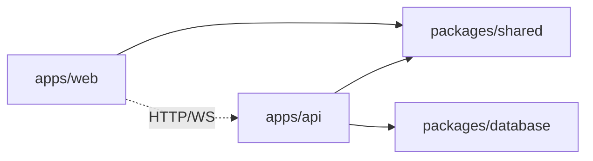

# Folder Structure

Monorepo using **pnpm workspaces** + **Turborepo** for build orchestration.

```
nebula-ai/
├── apps/
│   ├── web/                          # Next.js frontend
│   │   ├── src/
│   │   │   ├── app/                  # App Router pages
│   │   │   │   ├── (auth)/
│   │   │   │   │   ├── login/
│   │   │   │   │   ├── register/
│   │   │   │   │   └── layout.tsx
│   │   │   │   ├── (dashboard)/
│   │   │   │   │   ├── projects/
│   │   │   │   │   │   ├── page.tsx          # Project list
│   │   │   │   │   │   ├── new/page.tsx      # Create project
│   │   │   │   │   │   └── [id]/
│   │   │   │   │   │       ├── page.tsx      # Project workspace
│   │   │   │   │   │       ├── chat/page.tsx
│   │   │   │   │   │       ├── files/page.tsx
│   │   │   │   │   │       ├── tasks/page.tsx
│   │   │   │   │   │       └── settings/page.tsx
│   │   │   │   │   └── layout.tsx
│   │   │   │   ├── api/                      # Next.js route handlers (BFF proxy)
│   │   │   │   ├── layout.tsx
│   │   │   │   └── page.tsx                  # Landing page
│   │   │   ├── components/
│   │   │   │   ├── ui/                       # shadcn/ui primitives
│   │   │   │   ├── chat/
│   │   │   │   │   ├── ChatPanel.tsx
│   │   │   │   │   ├── MessageList.tsx
│   │   │   │   │   ├── MessageInput.tsx
│   │   │   │   │   └── AgentStatusBadge.tsx
│   │   │   │   ├── project/
│   │   │   │   │   ├── ProjectCard.tsx
│   │   │   │   │   ├── ProjectCreateForm.tsx
│   │   │   │   │   └── ProjectStatusBar.tsx
│   │   │   │   ├── workspace/
│   │   │   │   │   ├── FileTree.tsx
│   │   │   │   │   ├── CodeEditor.tsx
│   │   │   │   │   ├── TaskBoard.tsx
│   │   │   │   │   └── DiffViewer.tsx
│   │   │   │   └── layout/
│   │   │   │       ├── Sidebar.tsx
│   │   │   │       ├── Header.tsx
│   │   │   │       └── UserMenu.tsx
│   │   │   ├── hooks/
│   │   │   │   ├── useAuth.ts
│   │   │   │   ├── useProject.ts
│   │   │   │   ├── useChat.ts
│   │   │   │   └── useOrchestration.ts       # WebSocket events
│   │   │   ├── lib/
│   │   │   │   ├── api-client.ts
│   │   │   │   ├── ws-client.ts
│   │   │   │   └── utils.ts
│   │   │   ├── stores/
│   │   │   │   ├── auth-store.ts
│   │   │   │   ├── project-store.ts
│   │   │   │   └── chat-store.ts
│   │   │   └── types/
│   │   │       └── index.ts
│   │   ├── public/
│   │   ├── tailwind.config.ts
│   │   ├── next.config.ts
│   │   └── package.json
│   │
│   └── api/                          # Node.js backend
│       ├── src/
│       │   ├── index.ts              # Entry point
│       │   ├── app.ts                # Fastify app factory
│       │   ├── config/
│       │   │   ├── env.ts            # Zod-validated env
│       │   │   └── constants.ts
│       │   ├── routes/
│       │   │   ├── auth.routes.ts
│       │   │   ├── projects.routes.ts
│       │   │   ├── conversations.routes.ts
│       │   │   ├── files.routes.ts
│       │   │   ├── tasks.routes.ts
│       │   │   ├── agents.routes.ts
│       │   │   ├── github.routes.ts
│       │   │   └── health.routes.ts
│       │   ├── controllers/
│       │   │   ├── auth.controller.ts
│       │   │   ├── projects.controller.ts
│       │   │   ├── conversations.controller.ts
│       │   │   ├── files.controller.ts
│       │   │   ├── tasks.controller.ts
│       │   │   ├── agents.controller.ts
│       │   │   └── github.controller.ts
│       │   ├── services/
│       │   │   ├── auth.service.ts
│       │   │   ├── project.service.ts
│       │   │   ├── conversation.service.ts
│       │   │   ├── memory.service.ts
│       │   │   ├── vfs.service.ts            # Virtual file system
│       │   │   ├── task.service.ts
│       │   │   ├── github.service.ts
│       │   │   └── event.service.ts          # Orchestration events
│       │   ├── orchestration/
│       │   │   ├── engine.ts                 # Core orchestrator
│       │   │   ├── pipeline.ts               # Agent pipeline runner
│       │   │   ├── state-machine.ts          # Project status FSM
│       │   │   ├── queue.ts                  # Job queue interface
│       │   │   └── context-builder.ts        # Builds agent context
│       │   ├── agents/
│       │   │   ├── base-agent.ts
│       │   │   ├── planner.agent.ts
│       │   │   ├── coding.agent.ts
│       │   │   ├── prompts/
│       │   │   │   ├── planner.system.ts
│       │   │   │   └── coding.system.ts
│       │   │   └── tools/
│       │   │       ├── tool-registry.ts
│       │   │       ├── read-file.tool.ts
│       │   │       ├── write-file.tool.ts
│       │   │       ├── list-files.tool.ts
│       │   │       ├── run-command.tool.ts
│       │   │       └── create-task.tool.ts
│       │   ├── llm/
│       │   │   ├── provider.interface.ts
│       │   │   ├── provider.factory.ts
│       │   │   ├── openai.provider.ts
│       │   │   ├── anthropic.provider.ts
│       │   │   ├── google.provider.ts
│       │   │   └── deepseek.provider.ts
│       │   ├── middleware/
│       │   │   ├── auth.middleware.ts
│       │   │   ├── rate-limit.middleware.ts
│       │   │   └── error-handler.middleware.ts
│       │   ├── websocket/
│       │   │   ├── server.ts
│       │   │   └── handlers.ts
│       │   ├── jobs/
│       │   │   ├── worker.ts                 # BullMQ worker
│       │   │   └── processors/
│       │   │       ├── agent-run.processor.ts
│       │   │       └── github-push.processor.ts
│       │   └── utils/
│       │       ├── crypto.ts
│       │       ├── slug.ts
│       │       └── logger.ts
│       ├── prisma/
│       │   └── schema.prisma
│       └── package.json
│
├── packages/
│   ├── database/                     # Shared DB schema & migrations
│   │   ├── schema.sql
│   │   ├── prisma/
│   │   │   └── schema.prisma
│   │   └── package.json
│   ├── shared/                       # Shared types & validation
│   │   ├── src/
│   │   │   ├── types/
│   │   │   │   ├── project.ts
│   │   │   │   ├── agent.ts
│   │   │   │   ├── file.ts
│   │   │   │   └── events.ts
│   │   │   ├── schemas/              # Zod schemas
│   │   │   │   ├── auth.schema.ts
│   │   │   │   ├── project.schema.ts
│   │   │   │   └── agent.schema.ts
│   │   │   └── constants/
│   │   │       └── events.ts
│   │   └── package.json
│   └── config/                       # Shared ESLint, TS, Tailwind configs
│       ├── eslint/
│       ├── typescript/
│       └── tailwind/
│
├── infrastructure/
│   ├── docker/
│   │   ├── Dockerfile.api
│   │   ├── Dockerfile.web
│   │   └── Dockerfile.worker
│   ├── docker-compose.yml            # PostgreSQL, Redis, MinIO (S3)
│   └── terraform/                    # Production IaC (Phase 2+)
│
├── docs/
│   └── architecture/                 # This documentation
│
├── .github/
│   └── workflows/
│       ├── ci.yml
│       └── deploy.yml
│
├── turbo.json
├── pnpm-workspace.yaml
├── package.json
└── README.md
```

## Package Boundaries



| Package | Responsibility | Depends On |
|---------|---------------|------------|
| `apps/web` | UI, client state, WebSocket | `shared` |
| `apps/api` | REST, WS, orchestration, agents | `shared`, `database` |
| `packages/shared` | Types, Zod schemas, event constants | — |
| `packages/database` | Prisma schema, migrations, seed | — |

## Key Conventions

- **Barrel exports** — Each package exposes via `src/index.ts`
- **Path aliases** — `@nebula/shared`, `@nebula/database`
- **Env files** — `.env.local` (web), `.env` (api); never committed
- **Tests** — Co-located `*.test.ts` next to source files
- **No circular deps** — `shared` has zero internal package dependencies
