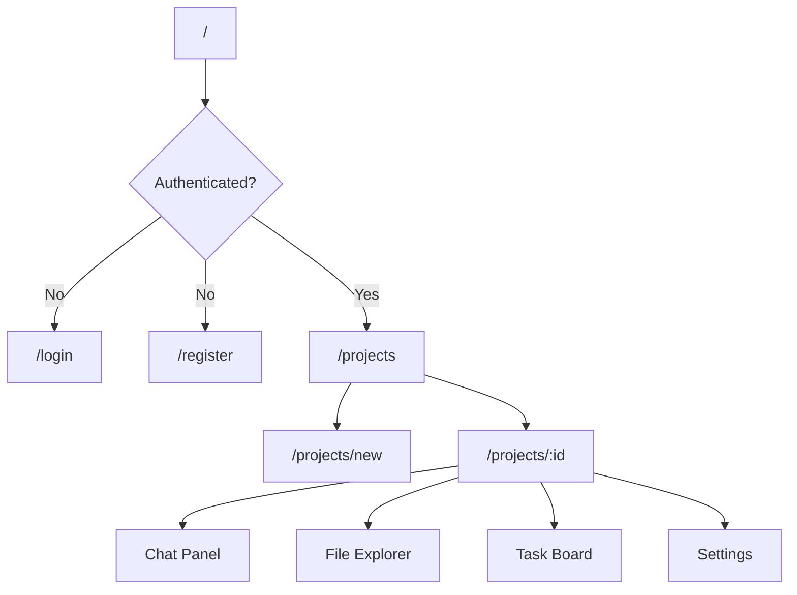
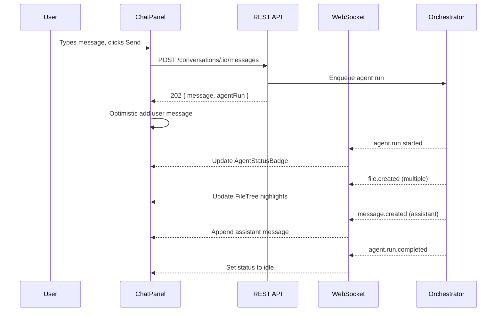

# Frontend Architecture

## Overview

Next.js 15 App Router SPA with server components for static shells and client components for interactive workspace features. The frontend is a **thin client** — all orchestration logic lives in the backend.

## Page Map



## Layout Hierarchy

```
RootLayout (fonts, providers, toasts)
├── (auth)/layout          → Centered card, no sidebar
│   ├── /login
│   └── /register
└── (dashboard)/layout     → Sidebar + header
    ├── /projects          → Grid of ProjectCards
    ├── /projects/new      → Prompt input form
    └── /projects/[id]     → Three-panel workspace
        ├── Left: FileTree + TaskBoard tabs
        ├── Center: CodeEditor or DiffViewer
        └── Right: ChatPanel
```

## State Management

| Layer | Tool | Scope |
|-------|------|-------|
| Server state | TanStack Query | API data (projects, files, tasks) |
| Real-time | WebSocket + Zustand | Orchestration events |
| UI state | React `useState` | Panel sizes, active tab, editor focus |
| Auth | Zustand + cookies | JWT token, user profile |

### TanStack Query Keys

```typescript
['projects']                          // list
['projects', projectId]               // detail
['projects', projectId, 'files']      // file tree
['projects', projectId, 'files', path] // file content
['projects', projectId, 'tasks']      // task tree
['projects', projectId, 'messages', conversationId]
['projects', projectId, 'agent-runs']
['projects', projectId, 'memory']
```

### Zustand: Orchestration Store

```typescript
interface OrchestrationState {
  subscribedProjectId: string | null;
  activeAgentRun: AgentRun | null;
  streamingMessage: string | null;
  recentEvents: OrchestrationEvent[];
  fileChanges: Map<string, FileChangeEvent>;

  subscribe: (projectId: string) => void;
  handleEvent: (event: WsEvent) => void;
}
```

On `file.created` / `file.updated` events, invalidate TanStack Query `['projects', id, 'files']` to refresh the tree.

## Key Components

### `ChatPanel`

- Renders `MessageList` with role-based styling (user, assistant, tool)
- `MessageInput` with send button and "Ask AI to build" CTA
- `AgentStatusBadge` shows live agent state (planning, coding, idle)
- Streams assistant tokens via WebSocket `message.created` events

### `FileTree`

- Recursive tree from `GET /projects/:id/files`
- Icons by file extension (via `vscode-icons` or custom map)
- Click → loads content in `CodeEditor`
- Highlights files changed in current agent run (from orchestration store)

### `CodeEditor`

- Monaco Editor with TypeScript/JSON/CSS syntax
- Read-only during agent runs; editable when idle
- Manual saves call `POST /projects/:id/files`
- Shows version badge and "View history" link

### `TaskBoard`

- Kanban-style columns: Pending → In Progress → Completed
- Tasks rendered from planner output
- Click task → shows description + linked files
- Real-time updates via `task.created` / `task.updated` WS events

### `ProjectCreateForm`

The primary onboarding flow:

1. Large textarea: "Describe your app in plain English"
2. Optional: project name, LLM provider selector
3. Submit → `POST /projects` → redirect to workspace
4. Auto-call `POST /projects/:id/start` to begin orchestration

## Data Flow: User Sends Message



## Authentication Flow

1. Login → `POST /auth/login` → store JWT in `httpOnly` cookie via Next.js route handler
2. Middleware (`middleware.ts`) checks cookie on `(dashboard)` routes
3. `useAuth` hook reads user from `GET /auth/me`
4. GitHub OAuth: redirect to `GET /github/connect` → callback sets `githubConnected`

## Styling

- **Tailwind CSS** with custom design tokens
- **shadcn/ui** for accessible primitives (Button, Dialog, Input, Tabs)
- Dark mode default (developer-tool aesthetic)
- CSS variables for theming:

```css
--nebula-primary: 262 80% 60%;     /* purple */
--nebula-surface: 224 20% 8%;
--nebula-border: 224 15% 18%;
```

## Performance

| Concern | Strategy |
|---------|----------|
| Large file trees | Virtualized list (`@tanstack/react-virtual`) |
| Chat history | Cursor pagination, load 50 at a time |
| Code editor | Lazy-load Monaco (dynamic import) |
| WebSocket | Reconnect with exponential backoff |
| Bundle size | Route-level code splitting (App Router default) |

## Error Handling

- API errors → toast notifications via `sonner`
- WebSocket disconnect → banner with "Reconnecting..."
- Agent failures → inline error card in chat with "Retry" button
- 401 → redirect to `/login`

## Accessibility

- Keyboard navigation in file tree (arrow keys)
- Chat input: Enter to send, Shift+Enter for newline
- ARIA live region for agent status updates
- Focus management on modal dialogs

## Environment Variables

```env
NEXT_PUBLIC_API_URL=https://api.nebula.ai/v1
NEXT_PUBLIC_WS_URL=wss://api.nebula.ai/v1/ws
```

## Testing Strategy

| Type | Tool | Coverage |
|------|------|----------|
| Unit | Vitest | Hooks, stores, utils |
| Component | Testing Library | ChatPanel, FileTree, forms |
| E2E | Playwright | Create project → chat → see files flow |
