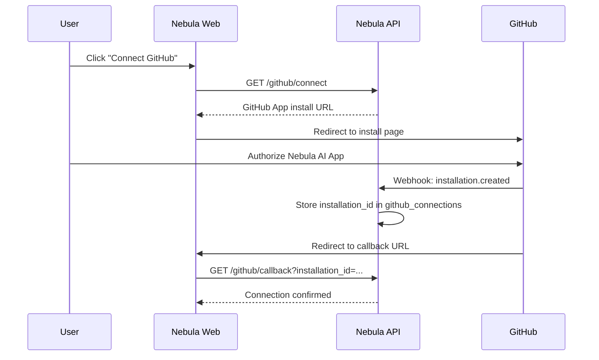
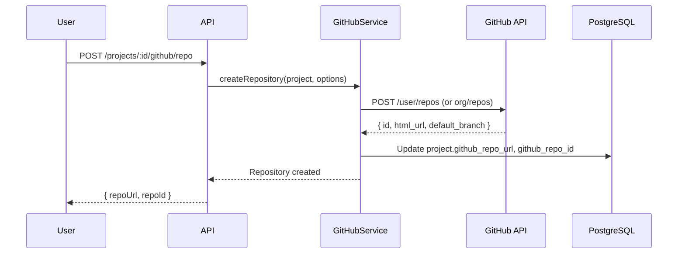
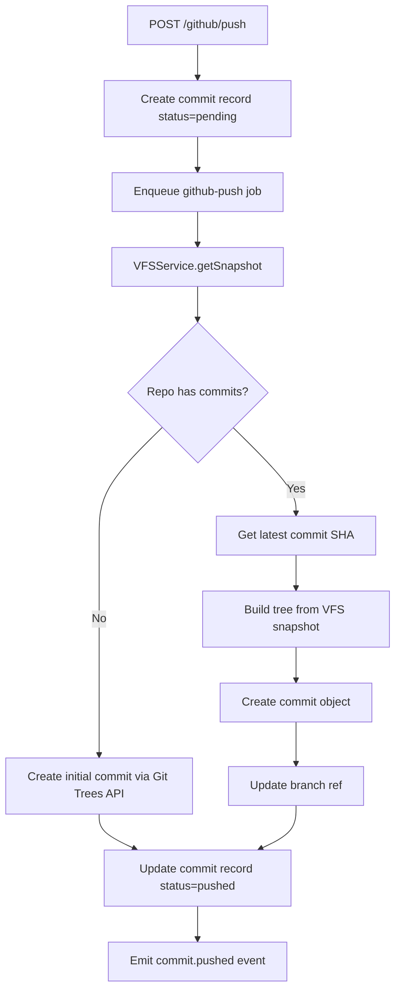

# GitHub Integration Architecture

## Overview

Nebula AI pushes generated code to the user's GitHub account via a **GitHub App** (not OAuth App). This provides granular permissions, higher rate limits, and organization support.

## Authentication Model



### Two Token Types

| Token | Purpose | Lifetime |
|-------|---------|----------|
| Installation access token | Repo operations (create, push) | 1 hour (auto-refresh) |
| User access token | Read user profile, list repos | Refreshable OAuth token |

### Token Storage

- Encrypted with AES-256-GCM before storing in `github_connections`
- Encryption key from `ENCRYPTION_KEY` env var (rotatable)
- Installation tokens are generated on-demand (not stored)

## GitHub App Configuration

```yaml
name: Nebula AI
url: https://nebula.ai
callback_url: https://api.nebula.ai/v1/github/callback
setup_url: https://nebula.ai/settings/github
webhook_url: https://api.nebula.ai/v1/github/webhook

permissions:
  contents: write          # Push code
  metadata: read           # Repo metadata
  administration: write    # Create repos

events:
  - installation
  - installation_repositories
```

## Repository Lifecycle

### 1. Create Repository



**GitHub API call:**
```http
POST /user/repos
{
  "name": "food-delivery-app",
  "description": "Generated by Nebula AI",
  "private": true,
  "auto_init": false
}
```

### 2. Push Code (VFS → GitHub)

The push operation converts the virtual file system snapshot into a real git commit.



### Git Trees API Approach

Used instead of local git CLI for serverless compatibility:

```typescript
async function pushToGitHub(project: Project, message: string): Promise<Commit> {
  const files = await vfs.getSnapshot(project.id);
  const installationToken = await github.getInstallationToken(project.userId);

  // 1. Get current branch HEAD (if exists)
  const ref = await github.getRef(installationToken, repo, branch);

  // 2. Create blobs for each file
  const blobs = await Promise.all(
    files.map(([path, content]) =>
      github.createBlob(installationToken, repo, content)
    )
  );

  // 3. Build tree
  const tree = blobs.map((blob, i) => ({
    path: files[i][0],
    mode: '100644',
    type: 'blob',
    sha: blob.sha,
  }));
  const treeSha = await github.createTree(installationToken, repo, tree, ref?.sha);

  // 4. Create commit
  const commitSha = await github.createCommit(installationToken, repo, {
    message,
    tree: treeSha,
    parents: ref ? [ref.sha] : [],
  });

  // 5. Update reference
  if (ref) {
    await github.updateRef(installationToken, repo, branch, commitSha);
  } else {
    await github.createRef(installationToken, repo, `refs/heads/${branch}`, commitSha);
  }

  return { sha: commitSha, status: 'pushed' };
}
```

### 3. Incremental Pushes

Each agent run can trigger an automatic push:

| Trigger | Commit Message Template |
|---------|------------------------|
| Planner complete | `plan: {summary}` |
| Coding task complete | `feat({task}): {title}` |
| Manual push | User-provided message |
| Full build complete | `feat: initial application generated by Nebula AI` |

**Idempotency:** `commits.agent_run_id` unique index prevents duplicate pushes for the same agent run.

## Service Interface

```typescript
class GitHubService {
  // Connection
  getInstallUrl(userId: string): string;
  handleCallback(code: string, installationId: number): GitHubConnection;
  disconnect(userId: string): void;
  getConnection(userId: string): GitHubConnection | null;

  // Token management
  getInstallationToken(userId: string): Promise<string>;

  // Repository
  createRepository(userId: string, options: CreateRepoOptions): Promise<GitHubRepo>;
  getRepository(userId: string, repoId: number): Promise<GitHubRepo>;

  // Push
  pushProject(projectId: string, message: string, branch?: string): Promise<Commit>;

  // Webhooks
  handleWebhook(event: string, payload: unknown): void;
}
```

## Webhook Handling

GitHub App webhooks for:

| Event | Action |
|-------|--------|
| `installation.created` | Store installation_id |
| `installation.deleted` | Remove github_connection |
| `installation_repositories.added` | Update available repos |
| `installation_repositories.removed` | Log repo removal |

Webhook signature verified via `X-Hub-Signature-256` header.

## Error Handling

| Error | HTTP Code | Recovery |
|-------|-----------|----------|
| GitHub not connected | 400 | Prompt user to connect |
| Token expired | 401 | Auto-refresh installation token |
| Repo name taken | 409 | Suggest alternative name with suffix |
| Rate limited | 403 | Retry with backoff (check `X-RateLimit-Reset`) |
| Push conflict | 409 | Fetch latest, rebase VFS snapshot, retry |
| Permission denied | 403 | Prompt to re-install GitHub App |

## Security

| Concern | Mitigation |
|---------|------------|
| Token leakage | AES-256-GCM encryption at rest |
| Webhook spoofing | HMAC signature verification |
| Repo access scope | Only repos created by Nebula or explicitly granted |
| Secret in generated code | Scanner before push (Phase 2) |
| Force push | Never force push; always fast-forward |

## Rate Limits

GitHub App installation tokens: **5,000 requests/hour** per installation.

| Operation | API Calls | Frequency |
|-----------|-----------|-----------|
| Create repo | 1 | Once per project |
| Push (Git Trees) | 3 + N blobs | Per agent run |
| Get repo info | 1 | On demand |

For a 50-file project, one push ≈ 54 API calls. Well within limits.

## User Experience

### Settings Page (`/projects/:id/settings`)

- **GitHub connection status:** Connected as `@username` or "Not connected"
- **Repository:** URL link or "Create repository" button
- **Auto-push toggle:** Push after each coding task (default: on)
- **Branch:** Configurable (default: `main`)

### In Workspace

- GitHub icon in header shows connection status
- After push: toast notification with link to commit on GitHub
- `commit.pushed` WebSocket event updates UI in real-time

## Future Enhancements (Phase 2+)

| Feature | Description |
|---------|-------------|
| Pull Requests | Create PR for review before merging to main |
| Branch per task | `nebula/task-{id}` branches |
| CI integration | Trigger GitHub Actions on push |
| Deploy hooks | Connect to Vercel/Netlify via GitHub |
| Template repos | Start from curated starter templates |
