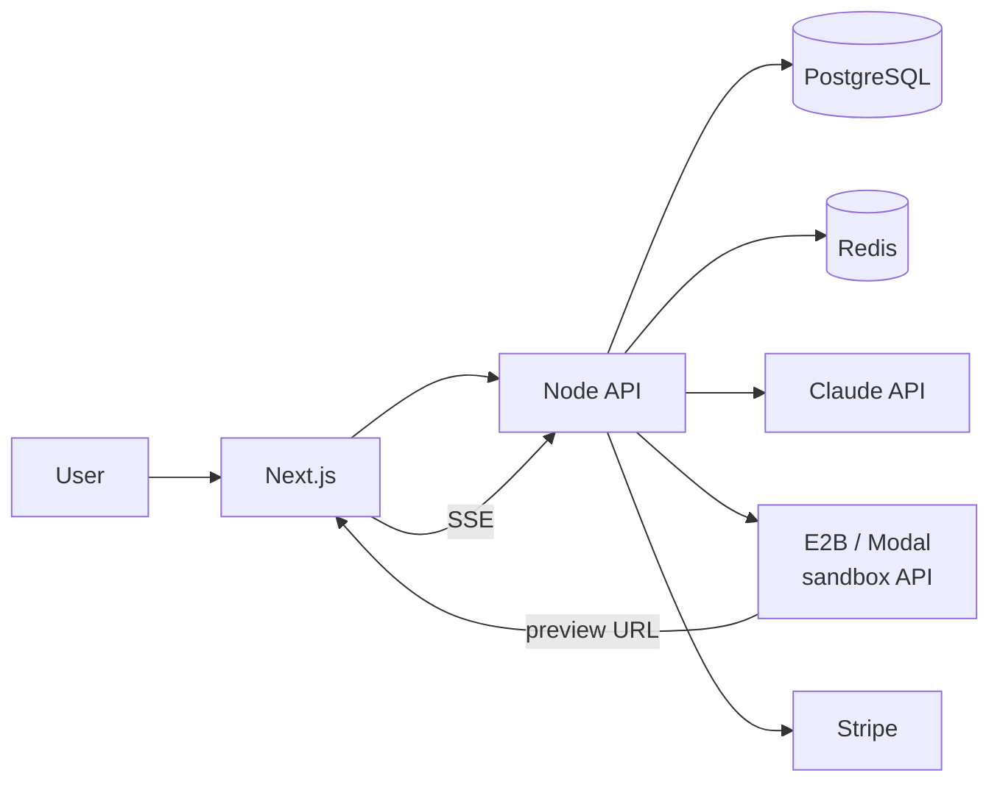

# A. Minimum Viable Architecture

## One Sentence

A Next.js app talks to a single Node.js API that runs **one Builder agent** and spins up **one preview container per project** via a managed sandbox API.

## Diagram



**Components: 5.** Web, API, Postgres, Redis, Sandbox API.  
**Processes: 1.** API serves HTTP + background jobs. No separate worker service.

## What the User Experiences

1. Sign up → Stripe checkout ($19/mo or $49/mo)
2. Enter prompt: *"Build a restaurant POS"*
3. Optional: answer 1–3 clarifying questions in chat
4. Watch files appear in tree + agent status stream
5. Preview loads in iframe (~2–5 min total)
6. Chat: *"Add a reservations page"* → agent edits files → preview refreshes

## Core Flow (3 Steps, Not 13)

```
Prompt → Clarify (optional) → Build → Preview
```

No DAG. No workflow engine. State machine with 5 statuses:

```
draft → clarifying → building → ready → failed
```

## Services (MVP)

| Service | Responsibility |
|---------|---------------|
| **Web** | Auth UI, workspace, chat, file tree, preview iframe, billing portal link |
| **API** | Auth, projects, messages, VFS, agent runner, preview lifecycle, Stripe webhooks |
| **Postgres** | All persistent state |
| **Redis** | Job queue (1 queue), rate limits, optional SSE pub/sub |
| **Sandbox API** | Run `npm install && npm run dev`, return URL (don't build your own) |

## Deferred to Post-Revenue (Keep Interfaces Loose)

| v2 Component | MVP Replacement | Upgrade Path |
|--------------|-------------------|--------------|
| Workflow engine (Temporal) | `project.status` + simple job queue | Extract when >3 agent types |
| Artifact registry | `projects.spec_json` column | Migrate to `artifacts` table |
| Model router | Hardcode Claude; add GPT later | Extract `ModelRouter` class |
| 6 BullMQ queues | 1 `build-jobs` queue | Split when jobs block each other |
| Firecracker pool | E2B / Modal / Daytona API | Self-host when preview cost > $2K/mo |
| WebSocket | SSE (simpler, one-way enough) | Add WS when bidirectional needed |
| preview-proxy microservice | Sandbox provider gives public URL | Self-host nginx when needed |
| Separate worker process | `setImmediate` / BullMQ in API process | Split at ~50 concurrent builds |

## File Ownership (MVP)

One agent owns all files. No path locks, no parallel agents, no merge conflicts.

## Revenue Architecture

| Tier | Price | Limits |
|------|-------|--------|
| **Starter** | $19/mo | 3 projects, 20 builds/mo, 2hr preview |
| **Pro** | $49/mo | 10 projects, 100 builds/mo, unlimited preview |

Free trial: 1 project, 3 builds, no credit card (conversion hook).

Stripe Checkout + Customer Portal. No custom billing UI beyond usage counters.

## Success Metrics (Day 90)

| Metric | Target |
|--------|--------|
| Paying users | 20–50 (path to 100 by month 5) |
| MRR | $1K–$2.5K |
| Build success rate | >60% preview loads |
| Time to preview | <8 min p50 |
| Founder burnout | Survivable |
