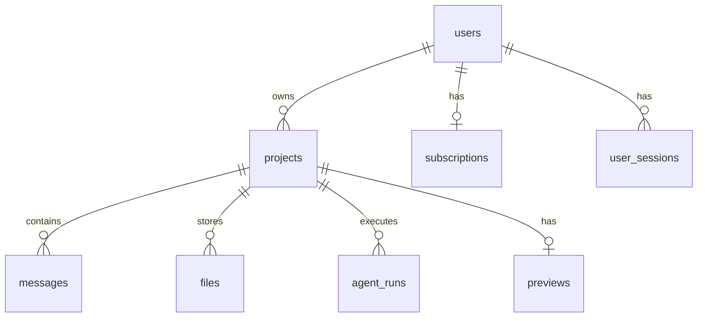

# C. Minimum Viable Database

## Principle

**8 tables.** Everything else is a column, JSONB field, or doesn't exist yet.

v2 added 12 tables. MVP keeps Phase 1 core and **skips schema-v2.sql entirely**.

## Tables



### 1. `users`

| Column | Notes |
|--------|-------|
| id, email, password_hash, name | Auth |
| stripe_customer_id | Billing |
| created_at | |

### 2. `user_sessions`

JWT session tracking. Keep from Phase 1.

### 3. `subscriptions`

**New (minimal billing).** Replaces usage_ledger + tiers complexity.

| Column | Notes |
|--------|-------|
| user_id | FK |
| stripe_subscription_id | |
| plan | `starter` \| `pro` |
| status | `active` \| `cancelled` \| `past_due` |
| builds_used_this_period | Integer counter |
| builds_limit | 20 or 100 |
| current_period_end | |

### 4. `projects`

| Column | Notes |
|--------|-------|
| id, user_id, name, slug, prompt | Core |
| status | `draft` \| `clarifying` \| `building` \| `ready` \| `failed` |
| spec_json | **Replaces** specification artifact + project_memory |
| preview_url | Denormalized |
| build_count | Integer |
| created_at, updated_at | |

**Delete from Phase 1 projects:** `github_*`, `llm_provider`, `llm_model`, `tech_stack`, `metadata`, `workflow_status`, `total_cost_usd`, `complexity`, `app_category`.

### 5. `messages`

Chat history. One conversation per project (no `conversations` table).

| Column | Notes |
|--------|-------|
| id, project_id, role | `user` \| `assistant` \| `system` |
| content | |
| created_at | |

**Delete:** `conversation_id`, `content_type`, `metadata`, `parent_id`, `agent_run_id`.

### 6. `files`

VFS. Simplified versioning.

| Column | Notes |
|--------|-------|
| id, project_id, path, content | |
| version | Keep but cap at 10 per path |
| created_at | |

**Delete:** `content_hash`, `storage_key`, `mime_type`, `is_directory`, `is_deleted`, `agent_run_id`, `parent_version_id`, `size_bytes`. Directories inferred from paths. No S3 — all content in TEXT (< 1MB total per project).

### 7. `agent_runs`

| Column | Notes |
|--------|-------|
| id, project_id, user_id | |
| agent_type | `clarifier` \| `builder` |
| status | `running` \| `completed` \| `failed` |
| input_prompt, output_summary | |
| tokens_input, tokens_output | |
| error_message | |
| created_at, completed_at | |

**Delete:** `plan_json`, `tool_calls`, `cost_usd`, `retry_count`, `parent_run_id`, `llm_provider`, `llm_model`, `workflow_node_id`, `milestone_id`, `artifact_ids`.

### 8. `previews`

| Column | Notes |
|--------|-------|
| id, project_id | One active per project |
| sandbox_id | External provider ID |
| url | Public preview URL |
| status | `starting` \| `ready` \| `stopped` \| `error` |
| expires_at | |
| created_at | |

**Replaces:** `preview_environments`, `build_runs`, `build_logs`, `deployments`.

## Tables DELETED (vs Phase 1 + v2)

| Table | Why Deleted |
|-------|-------------|
| `conversations` | 1 chat per project |
| `tasks` / `milestones` | User sees files + preview, not task board |
| `commits` | No GitHub |
| `project_memory` | `spec_json` on projects |
| `orchestration_events` | SSE emits live; no audit archive |
| `github_connections` | No GitHub |
| `user_oauth_accounts` | Email auth only for MVP (Google = week 8 nice-to-have) |
| All v2 tables | workflow_runs, artifacts, clarifications, build_runs, file_locks, pull_requests, usage_ledger, model_routing_config |

## Indexes (Only 4)

```sql
CREATE INDEX idx_projects_user ON projects(user_id);
CREATE INDEX idx_messages_project ON messages(project_id, created_at);
CREATE INDEX idx_files_project_path ON files(project_id, path);
CREATE INDEX idx_agent_runs_project ON agent_runs(project_id, created_at DESC);
```

## Migration Path to v2

| MVP | Full Platform |
|-----|---------------|
| `spec_json` | → `artifacts` type=specification |
| `agent_runs` | → add columns, keep data |
| `files` | → add S3 storage_key when files grow |
| `previews` | → `preview_environments` |
| `subscriptions.builds_used` | → `usage_ledger` |

No throwaway schema. Extend, don't rewrite.
