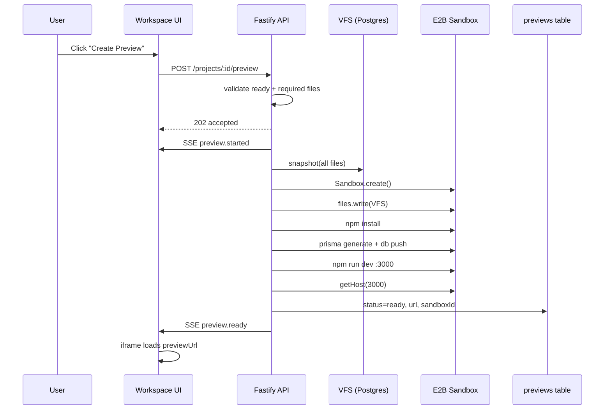

# Phase 3 — Preview MVP (E2B)

## Folder Tree (new / changed)

```
apps/api/src/
├── services/
│   ├── preview.service.ts      # NEW — E2B sandbox lifecycle
│   └── vfs.service.ts          # + snapshot()
├── routes/
│   └── preview.routes.ts       # NEW — preview CRUD
├── config/env.ts               # + E2B_API_KEY, PREVIEW_TTL_MS
└── app.ts                      # register previewRoutes

apps/web/src/
├── components/workspace/
│   └── PreviewPanel.tsx        # NEW — iframe + states
├── app/projects/[id]/page.tsx  # center = preview when no file selected
└── lib/api.ts                  # + getPreview, startPreview, deletePreview

packages/shared/src/constants/events.ts  # + preview.* SSE events
packages/database/prisma/
├── schema.prisma               # Preview.updatedAt
└── migrations/20250607120000_preview_updated_at/

scripts/verify-preview-mvp.ts
```

## API Routes

| Method | Path | Description |
|--------|------|-------------|
| `POST` | `/v1/projects/:id/preview` | Start preview (202 async) |
| `GET` | `/v1/projects/:id/preview` | Get preview status + URL |
| `DELETE` | `/v1/projects/:id/preview` | Stop sandbox, clear preview |

**Validation (POST):** `status === ready` + `validateBuildReady` (package.json, prisma/schema.prisma, page.tsx, layout.tsx).

## Preview Flow



## Environment Variables

| Variable | Required | Default | Description |
|----------|----------|---------|-------------|
| `E2B_API_KEY` | Yes (for preview) | `""` | E2B API key from [e2b.dev/dashboard](https://e2b.dev/dashboard) |
| `PREVIEW_TTL_MS` | No | `7200000` (2h) | Preview expiry metadata |
| `PREVIEW_SANDBOX_TIMEOUT_MS` | No | `900000` (15m) | E2B sandbox max lifetime |

## Setup Instructions

1. **Get E2B API key** — sign up at [e2b.dev](https://e2b.dev), copy API key.
2. **Add to `.env`:**
   ```env
   E2B_API_KEY=e2b_...
   ```
3. **Install dependencies:**
   ```bash
   pnpm install
   pnpm db:migrate:dev
   ```
4. **Start stack:**
   ```bash
   pnpm dev
   ```
5. **Create preview:**
   - Build a project to `ready` status.
   - Open workspace → click **Create Preview** in center panel.
   - Wait for SSE `preview.ready` → iframe loads live URL.

6. **Verify (no E2B calls):**
   ```bash
   pnpm verify:preview-mvp
   ```

## Cost Estimate Per Preview

| Component | Estimate | Notes |
|-----------|----------|-------|
| E2B sandbox | **~$0.10–0.30** | ~5–15 min × ~$0.01–0.02/min (varies by plan) |
| `npm install` CPU time | included | Largest time cost in sandbox |
| Neon Postgres | negligible | VFS read only |
| API compute | negligible | Orchestration only |

**At 100 users × 3 previews/day:** ~$30–90/day E2B variable cost. Set `PREVIEW_TTL_MS` and manual-only creation to control spend.

## Deliberately Not Implemented

- Auto-preview on READY (manual trigger only)
- GitHub, Stripe, teams, multi-model routing
- Custom domains, production deployment
- Custom sandbox / Kubernetes infrastructure
