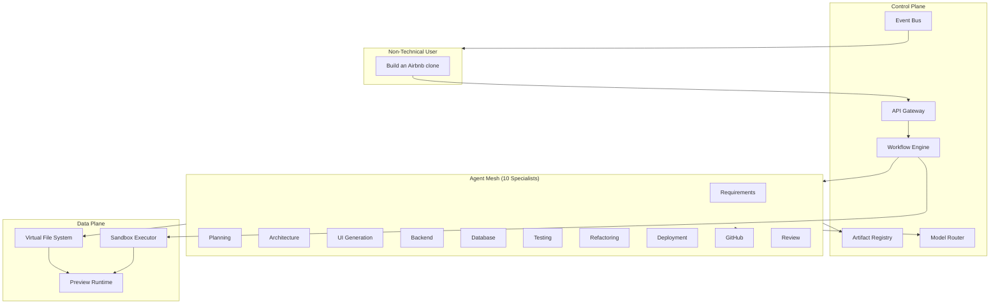

# Nebula AI — Platform Architecture (v2)

> **Status:** Design authority document. Supersedes Phase 1 orchestration-only assumptions where they conflict.
> **Audience:** Engineering, product, infrastructure.
> **Horizon:** 3-year competitive roadmap vs Cursor, Lovable, Bolt, Replit Agent.

## Executive Summary

Phase 1 designed Nebula as a **two-agent orchestration engine** (Planner + Coding). That architecture cannot produce complete, working applications for non-technical users. It lacks:

- Structured requirement gathering with clarification loops
- Specialized generation (UI, backend, database as separate concerns)
- Verified execution (build, test, preview)
- Intelligent multi-model routing
- Deployment and live preview

**v2 redesign:** Nebula becomes a **multi-agent software factory** with a DAG workflow engine, versioned artifact store, isolated execution plane, and live preview environments.



## What Changed from Phase 1

| Phase 1 Assumption | Why It's Weak | v2 Design |
|-------------------|---------------|-----------|
| 2 agents do everything | Jack-of-all-trades prompts fail at scale | 10 specialist agents + Review gate |
| Linear state machine | Real builds need loops and parallelism | DAG workflow engine with cycles |
| `project_memory` key-value | Unstructured, unversioned, ambiguous | Versioned **Artifact Registry** |
| GitHub push as finale | Users need working app, not just code | Preview environment is the deliverable |
| No code execution | "Working application" unverifiable | Isolated **Sandbox Executor** |
| Single LLM per project | Wrong model for wrong task = cost + quality loss | **Model Router** per agent/task |
| One job queue | Head-of-line blocking | Priority queues per agent class |
| Files only | Agents need contracts, not raw text | Structured artifacts (spec, API schema, design tokens) |

## Document Index

| # | Deliverable | Document |
|---|-------------|----------|
| 1 | Complete System Architecture | [system-architecture.md](./system-architecture.md) |
| 2 | Agent Communication Design | [agent-communication.md](./agent-communication.md) |
| 3 | Event Architecture | [event-architecture.md](./event-architecture.md) |
| 4 | Database Updates | [database-v2.md](./database-v2.md) |
| 5 | Queue & Worker Architecture | [queue-workers.md](./queue-workers.md) |
| 6 | Scaling Strategy | [scaling-strategy.md](./scaling-strategy.md) |
| 7 | Cost Control Strategy | [cost-control.md](./cost-control.md) |
| 8 | Security Strategy | [security-strategy.md](./security-strategy.md) |
| 9 | Folder Structure | [folder-structure-v2.md](./folder-structure-v2.md) |
| 10 | Production Roadmap | [production-roadmap.md](./production-roadmap.md) |

## Canonical Build Flow

```
User Prompt
    ↓
Requirements Agent ──(clarification loop)──→ Specification Artifact
    ↓
Planning Agent ──────────────────────────→ Roadmap + Milestone DAG
    ↓
Architecture Agent ──────────────────────→ Stack + FE/BE/DB/API Artifacts
    ↓
┌───────────────┬───────────────┬────────────────┐
│  UI Agent     │ Backend Agent │ Database Agent │  (parallel)
└───────┬───────┴───────┬───────┴────────┬───────┘
        └───────────────┼────────────────┘
                        ↓
              Integration Checkpoint (build)
                        ↓
              Testing Agent
                        ↓
         ┌──── fail ────┴──── pass ────┐
         ↓                             ↓
  Refactoring Agent              Review Agent
         ↓                             ↓
    (retry Testing)              GitHub Agent
                                       ↓
                              Deployment Agent
                                       ↓
                              Preview Environment ✓
```

## Competitive Positioning (3-Year)

| Competitor | Strength | Nebula Counter |
|------------|----------|----------------|
| **Lovable** | Fast UI preview, non-technical UX | Match preview speed + deeper backend/DB generation |
| **Bolt** | In-browser full-stack | Match immediacy + stronger verification loop |
| **Replit Agent** | Execution environment | Match sandbox + exceed with structured multi-agent pipeline |
| **Cursor** | Developer power | Different audience — Nebula owns **non-technical** market; Cursor integration as export path (Phase 3) |

**Nebula moat:** Verified end-to-end delivery (spec → architecture → code → tests → preview → GitHub) with full audit trail and cost transparency.
