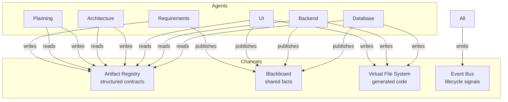
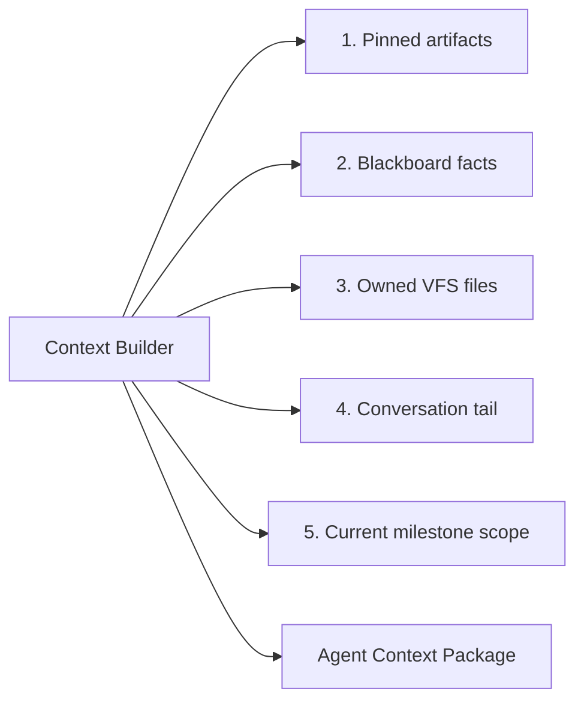
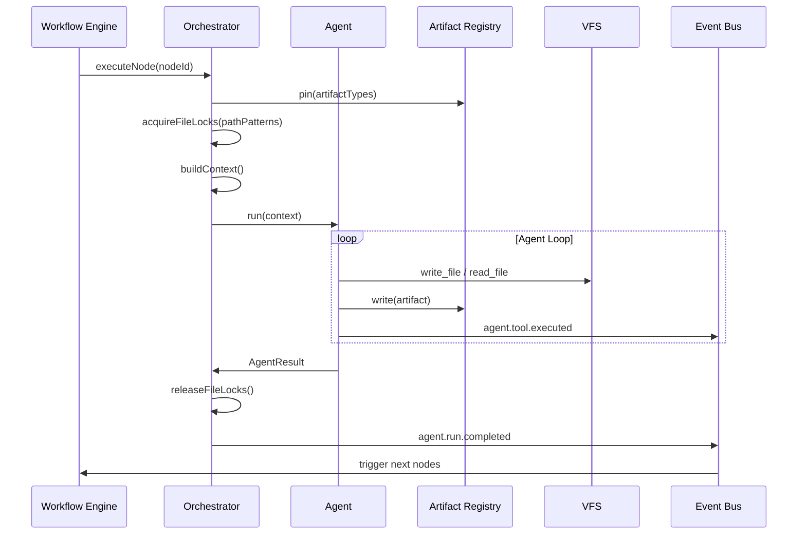
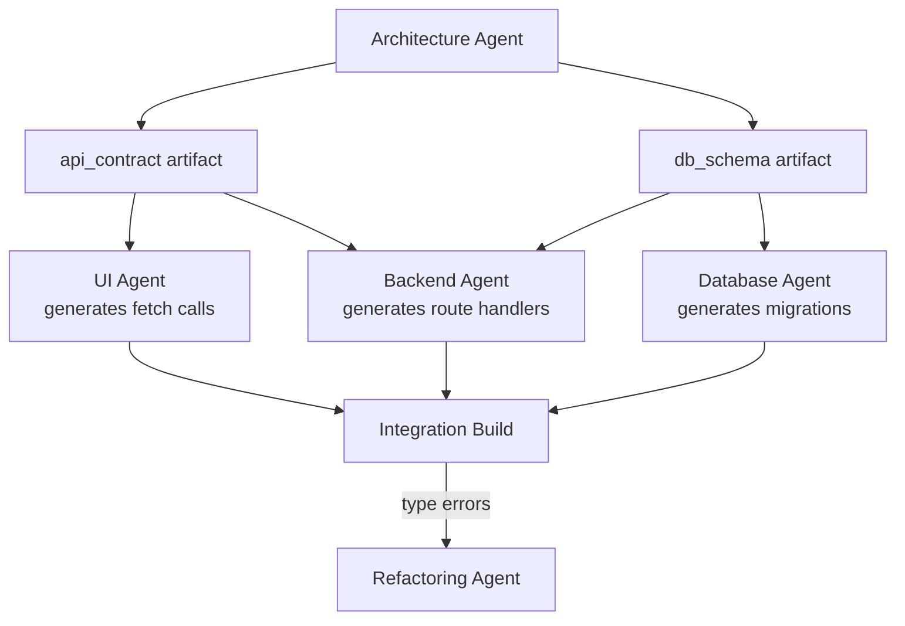
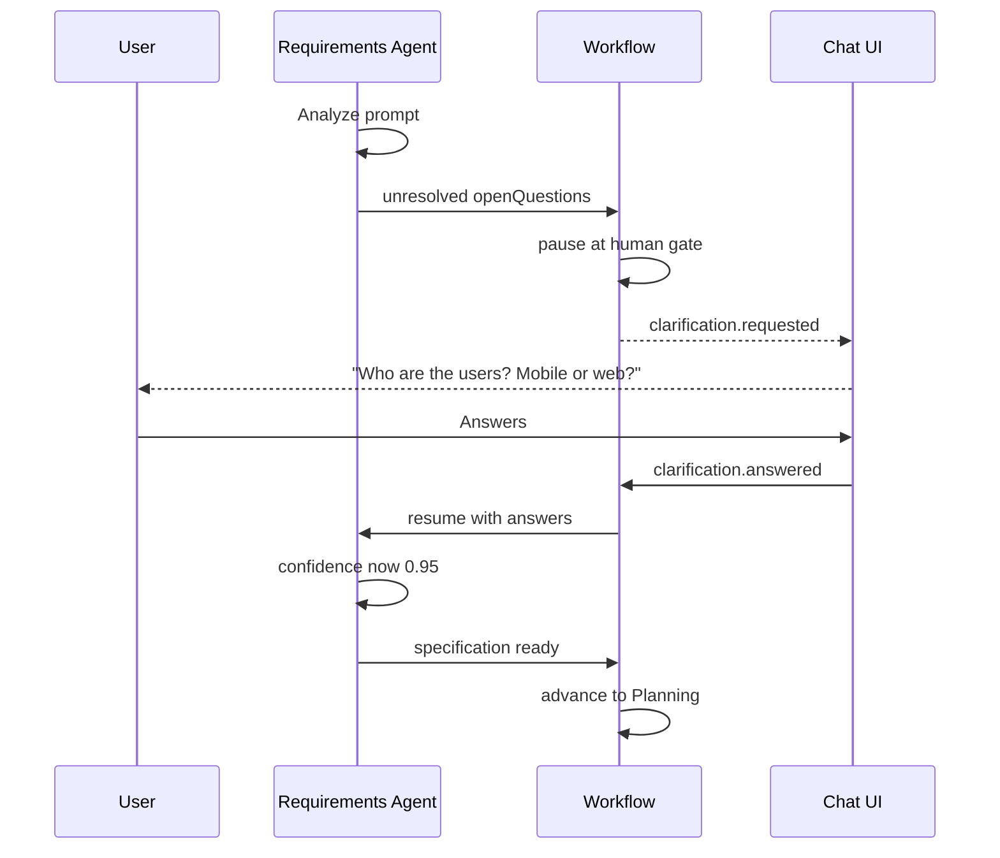

# Agent Communication Design

## Problem

Ten specialist agents must coordinate without:
- Overwriting each other's work
- Diverging from agreed architecture
- Exceeding context windows
- Creating inconsistent APIs between frontend and backend

Phase 1's approach (shared `project_memory` + VFS) fails at this scale. v2 uses three communication channels.

## Communication Model



### Channel 1: Artifact Registry (Contracts)

**Purpose:** Versioned, typed, immutable outputs that downstream agents MUST conform to.

| Artifact Type | Producer | Consumers | Mutable |
|--------------|----------|-----------|---------|
| `specification` | Requirements | Planning, Architecture | New version only |
| `roadmap` | Planning | All generation agents | New version only |
| `architecture` | Architecture | UI, Backend, Database, Testing | New version only |
| `api_contract` | Architecture | UI, Backend, Testing | New version only |
| `db_schema` | Architecture, Database | Backend, Testing | New version only |
| `design_system` | UI | UI (self), Refactoring | New version only |
| `test_report` | Testing | Refactoring, Review | New version only |
| `review_report` | Review | Refactoring, GitHub | New version only |
| `refactor_report` | Refactoring | Review | New version only |

**Rules:**
1. Agents NEVER modify another agent's artifact — they create a new version.
2. Workflow engine pins artifact versions at node start. Mid-run artifact updates are invisible.
3. Artifact schema validated by Zod at write time. Invalid artifacts reject the agent run.

```typescript
interface Artifact<T> {
  id: string;
  projectId: string;
  type: ArtifactType;
  version: number;
  producerAgentRunId: string;
  content: T;
  contentHash: string;
  createdAt: string;
}

interface ArtifactRegistry {
  write<T>(type: ArtifactType, content: T, ctx: AgentContext): Promise<Artifact<T>>;
  getLatest<T>(projectId: string, type: ArtifactType): Promise<Artifact<T> | null>;
  getVersion<T>(projectId: string, type: ArtifactType, version: number): Promise<Artifact<T>>;
  pin(projectId: string, types: ArtifactType[]): Promise<ArtifactPinSet>;
}
```

### Channel 2: Blackboard (Shared Facts)

**Purpose:** Small, frequently-updated facts that don't warrant full artifacts.

| Key | Example | Writers |
|-----|---------|---------|
| `current_milestone` | `"auth-module"` | Workflow engine |
| `file_ownership` | `{ "src/components/*": "ui" }` | Orchestrator |
| `blocked_paths` | `["prisma/schema.prisma"]` | Database agent |
| `integration_errors` | `[{ file, line, message }]` | Sandbox |
| `conventions` | `{ "naming": "camelCase" }` | Architecture agent |

**Implementation:** Redis hash per project, TTL = project lifetime.

```typescript
interface Blackboard {
  get(projectId: string, key: string): Promise<unknown>;
  set(projectId: string, key: string, value: unknown, writer: AgentType): Promise<void>;
  getAll(projectId: string): Promise<Record<string, unknown>>;
}
```

Blackboard writes emit `blackboard.updated` events (low priority, not streamed to UI).

### Channel 3: Virtual File System (Generated Code)

**Purpose:** The actual application source code.

**Ownership rules:**

| Path Pattern | Owner Agent | Others |
|-------------|-------------|--------|
| `src/app/**`, `src/components/**` | UI | Read-only |
| `src/app/api/**`, `src/lib/**`, `src/services/**` | Backend | Read-only |
| `prisma/**`, `drizzle/**`, `supabase/**` | Database | Read-only |
| `__tests__/**`, `e2e/**`, `*.test.*` | Testing | Read-only |
| `*.config.*`, `.github/**`, `Dockerfile` | Deployment | Read-only |
| `package.json` | Orchestrator | Merge agent only |

**File lock protocol:**

```
1. Agent run starts → Orchestrator acquires locks on owned paths
2. Agent writes via write_file tool → VFS creates new version
3. Agent completes → locks released
4. Parallel agents have non-overlapping path ownership → no conflict
5. Integration checkpoint → global lock → merge package.json deps
```

**Conflict resolution (when ownership overlaps):**

```
1. Detect conflict at integration checkpoint
2. If trivial (import path) → deterministic fix
3. If semantic → enqueue Refactoring agent with both versions
4. Never silently overwrite
```

### Channel 4: Event Bus (Lifecycle Signals)

Agents do NOT call each other directly. The workflow engine reacts to events.

```
Agent completes → agent.run.completed event
                → Workflow engine evaluates DAG
                → Enqueues next node(s)
```

See [event-architecture.md](./event-architecture.md).

## Context Assembly

Before each agent run, the **Context Builder** assembles input from all channels:



### Token Budget Allocation

| Priority | Content | Budget % | Truncation |
|----------|---------|----------|------------|
| P0 | System prompt + agent instructions | 10% | Never |
| P1 | Pinned artifacts (architecture, spec) | 25% | Summarize if needed |
| P2 | Current milestone scope | 15% | Never |
| P3 | Owned VFS files (full content) | 30% | Exclude binary |
| P4 | Conversation tail (last 8 messages) | 10% | Drop oldest |
| P5 | Blackboard facts | 5% | Key facts only |
| P6 | Dependency files (read via tool) | 5% | On-demand via tools |

When budget exceeded: summarize P1 via cheap model (DeepSeek) before truncating P3.

## Agent Handoff Protocol



## Inter-Agent Dependencies (API Contract Sync)

The critical sync point between UI, Backend, and Database:



**api_contract artifact** is the single source of truth:

```typescript
interface ApiContract {
  version: number;
  baseUrl: string;
  endpoints: Array<{
    method: "GET" | "POST" | "PUT" | "PATCH" | "DELETE";
    path: string;
    description: string;
    requestBody?: JSONSchema;
    responseBody: JSONSchema;
    auth: boolean;
  }>;
  types: Record<string, JSONSchema>;  // shared TypeScript types
}
```

UI agent generates API client from this. Backend agent generates handlers. Testing agent generates contract tests.

## Clarification Protocol (Requirements ↔ User)



Clarifications stored in `clarification_requests` table. Max 3 rounds before auto-proceeding with assumptions (logged in spec).

## Anti-Patterns (Explicitly Forbidden)

| Anti-Pattern | Why | Alternative |
|-------------|-----|-------------|
| Agent-to-agent direct calls | Tight coupling, no audit | Event-driven workflow |
| Shared mutable state | Race conditions | Artifact versioning + file locks |
| Monolithic mega-prompt | Context overflow, quality collapse | Specialist agents with pinned artifacts |
| Silent file overwrite | Data loss | Immutable VFS versions |
| Skipping integration build | Testing garbage code | Mandatory sandbox build gate |
| Same model for all agents | Cost + quality mismatch | Model Router |

## Agent Tool Access Matrix

| Tool | REQ | PL | ARCH | UI | BE | DB | TEST | REF | DEP | GH | REV |
|------|-----|----|----|----|----|----|----|----|----|----|-----|
| `read_file` | | | ✓ | ✓ | ✓ | ✓ | ✓ | ✓ | ✓ | ✓ | ✓ |
| `write_file` | | | | ✓ | ✓ | ✓ | ✓ | ✓ | ✓ | | |
| `write_artifact` | ✓ | ✓ | ✓ | ✓ | | ✓ | ✓ | | | | ✓ |
| `read_artifact` | ✓ | ✓ | ✓ | ✓ | ✓ | ✓ | ✓ | ✓ | ✓ | ✓ | ✓ |
| `run_build` | | | | | | | | | | | |
| `run_tests` | | | | | | | ✓ | | | | |
| `create_branch` | | | | | | | | | | ✓ | |
| `create_pr` | | | | | | | | | | ✓ | |
| `ask_clarification` | ✓ | | | | | | | | | | |
| `search_files` | | | ✓ | ✓ | ✓ | ✓ | ✓ | ✓ | | | ✓ |

`run_build` and `run_tests` are workflow-level sandbox operations, not agent tools — preventing agents from infinite build loops.
