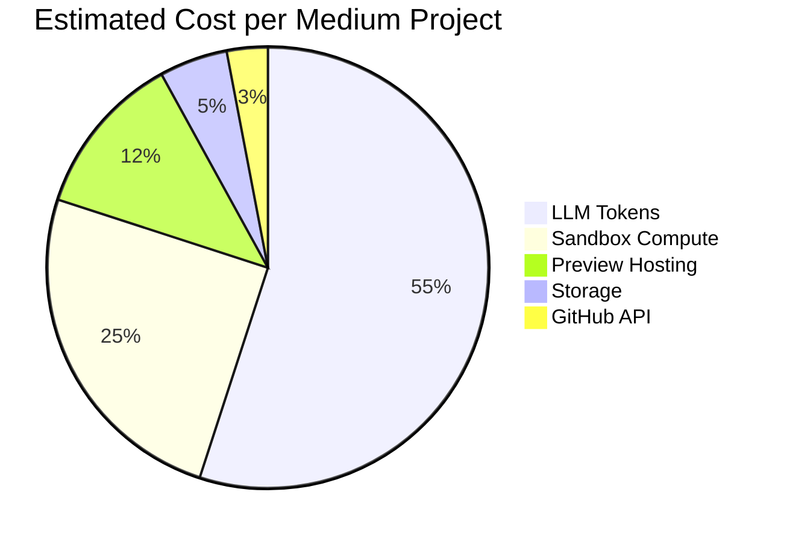
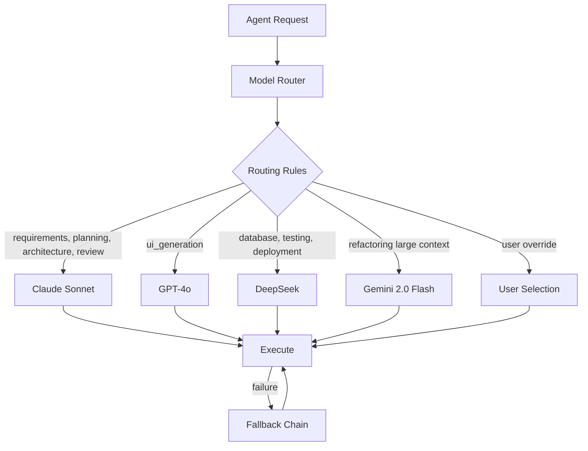

# Cost Control Strategy

## Cost Structure

A single "Build an Airbnb clone" project incurs costs across five categories:



| Category | Typical Cost (Medium App) | Drivers |
|----------|--------------------------|---------|
| LLM tokens | $2.00 - $8.00 | Agent count, model selection, iteration loops |
| Sandbox compute | $0.50 - $2.00 | Build attempts, test runs, refactor cycles |
| Preview hosting | $0.10 - $0.50/day | Container uptime, memory allocation |
| Storage | $0.01 - $0.05 | VFS files, artifacts, build logs |
| GitHub API | $0.00 | Within free tier limits |

**Target:** Complete medium project for **< $5.00** LLM + infra cost at launch.

## Model Router (Central Cost Lever)



### Default Routing Table

| Agent | Primary Model | Fallback 1 | Fallback 2 | Rationale |
|-------|--------------|------------|------------|-----------|
| Requirements | Claude Sonnet | GPT-4o | — | Nuanced intent understanding |
| Planning | Claude Sonnet | GPT-4o | — | Structured reasoning |
| Architecture | Claude Sonnet | GPT-4o | — | System design quality |
| UI Generation | GPT-4o | Claude Sonnet | Gemini Flash | Best JSX/CSS output |
| Backend Generation | Claude Sonnet | GPT-4o | DeepSeek | API design quality |
| Database | DeepSeek Coder | Gemini Flash | Claude Haiku | Cost-efficient SQL |
| Testing | DeepSeek Coder | Gemini Flash | — | Test boilerplate |
| Refactoring | Gemini 2.0 Flash | Claude Sonnet | — | 1M context for wide refactors |
| Review | Claude Sonnet | GPT-4o | — | Quality assessment |
| Deployment | DeepSeek | Gemini Flash | — | Config generation |
| GitHub | None (API only) | — | — | Deterministic |

### Routing Algorithm

```typescript
interface ModelRouter {
  assign(agentType: AgentType, context: RoutingContext): ModelAssignment;
}

function assign(agentType: AgentType, ctx: RoutingContext): ModelAssignment {
  // 1. User override (project-level)
  if (ctx.projectConfig?.defaults[agentType]) {
    return { ...ctx.projectConfig.defaults[agentType], reason: 'user_override' };
  }

  // 2. Budget check — downgrade if near ceiling
  if (ctx.projectCostUsd > ctx.costCeilingUsd * 0.8) {
    return downgradeToCheapest(agentType, reason: 'budget_pressure');
  }

  // 3. Complexity adjustment
  if (ctx.complexity === 'simple') {
    return downgradeOneTier(DEFAULT_ROUTING[agentType], reason: 'simple_app');
  }

  // 4. Default routing
  return { ...DEFAULT_ROUTING[agentType], reason: 'default' };
}

function downgradeToCheapest(agent: AgentType): ModelAssignment {
  // Claude Sonnet → Claude Haiku → DeepSeek
  // GPT-4o → GPT-4o-mini → DeepSeek
  // Never downgrade Requirements or Review below Sonnet tier
}
```

### User Override

Users can override at two levels:

| Level | UI | Effect |
|-------|-----|--------|
| Project default | Settings → AI Models | All agents use specified models |
| Per-build | "Use best models" toggle on create | Forces premium routing |

Non-technical users see: **"Fast"** (cost-optimized) vs **"Best quality"** (premium models).

## Budget System

### Per-Project Budget

```typescript
interface ProjectBudget {
  ceilingUsd: number;          // Default: $5 (free), $20 (pro), $100 (team)
  spentUsd: number;            // Running total from usage_ledger
  remainingUsd: number;        // ceiling - spent
  percentUsed: number;
  status: 'ok' | 'warning' | 'exceeded' | 'paused';
}
```

| Threshold | Action |
|-----------|--------|
| 50% | UI shows cost meter (subtle) |
| 80% | Warning toast + auto-downgrade models |
| 95% | Pause workflow, ask user to approve overage |
| 100% | Hard stop, offer upgrade or reduce scope |

### Per-User Monthly Budget

| Tier | Monthly LLM Budget | Projects | Preview Hours |
|------|-------------------|----------|---------------|
| Free | $10 | 3 active | 24h total |
| Pro ($29/mo) | $100 | 20 active | Unlimited |
| Team ($99/mo) | $500 | Unlimited | Unlimited |
| Enterprise | Custom | Unlimited | Custom |

## Token Optimization

| Technique | Savings | Implementation |
|-----------|---------|----------------|
| Artifact pinning (not re-sending) | 30-40% | Context builder uses pinned versions |
| Tool result compression | 10-15% | Summarize file contents > 500 lines |
| Conversation tail only (8 msgs) | 20% | Drop old messages |
| Cached system prompts | 5% | Provider prompt caching (Anthropic, OpenAI) |
| DeepSeek for boilerplate | 40-60% on those agents | Model router |
| Skip re-planning on minor edits | 50% on iterations | Detect change scope |

### Prompt Caching

```
Architecture artifact + system prompt = cached prefix
Only milestone-specific context changes per agent run
Anthropic cache: 90% discount on cached tokens
OpenAI cache: 50% discount
```

## Sandbox Cost Control

| Control | Setting |
|---------|---------|
| Max build time | 10 minutes |
| Max test time | 15 minutes |
| Max refactor loops | 3 cycles |
| Max concurrent sandboxes per user | 2 (free), 5 (pro) |
| Preview auto-stop | 1 hour idle (free), 24h (pro) |
| Sandbox memory cap | 512MB (simple), 2GB (complex) |

**Refactor loop cost cap:**
```
Loop 1: free (included)
Loop 2: free (included)
Loop 3: warn user "attempting final fix"
Loop 4: blocked — ask user to simplify or upgrade
```

## Storage Cost Control

| Data | Limit (Free) | Limit (Pro) | Cleanup |
|------|-------------|-------------|---------|
| VFS file versions | 50 per path | 200 per path | Prune oldest |
| Build logs | 7 days | 30 days | Auto-delete |
| Artifacts | All versions | All versions | Never (small) |
| Event stream | 7 days | 30 days | Archive to S3 |
| Preview bundles | 1 per project | 5 per project | TTL delete |

## Revenue vs Cost Model (Year 1 Target)

| Metric | Target |
|--------|--------|
| Avg cost per project (medium) | $4.50 |
| Free tier projects/month | 3 per user |
| Free tier cost per user | $13.50/month |
| Pro conversion rate | 8% |
| Pro revenue per user | $29/month |
| Pro avg projects/month | 10 |
| Pro avg cost | $45/month |
| Pro gross margin | 55% ($29 - $13.50 allocated) |
| Blended gross margin | 65%+ at 8% conversion |

**Break-even:** ~6% Pro conversion at $29/month.

## Cost Monitoring Dashboard (Internal)

| Panel | Metrics |
|-------|---------|
| Unit economics | Cost per project by complexity tier |
| Model spend | Breakdown by provider + model |
| Agent efficiency | Tokens per file generated |
| Sandbox utilization | Cost per build minute |
| Preview cost | Cost per preview-hour |
| Budget hits | % of projects hitting ceiling |
| Refactor loops | Avg cycles before pass |

## Cost Anomaly Detection

| Anomaly | Detection | Response |
|---------|-----------|----------|
| Runaway agent loop | >25 iterations | Kill run, alert |
| Token spike | >50K tokens single call | Pause, investigate prompt |
| Repeated build failures | >5 builds in 10 min | Pause workflow |
| Preview leak | Container >24h | Force stop |
| User abuse | >50 projects/day | Rate limit + review |

## Competitive Cost Positioning

| Platform | Est. Cost per App | Nebula Target |
|----------|-------------------|---------------|
| Lovable | ~$3-10 (credits) | Match with "Fast" mode |
| Bolt | ~$5-15 | Match with transparency |
| Replit Agent | ~$5-20 (compute) | Undercut on simple apps |
| Custom dev | $5,000-50,000 | 1000x cheaper (the pitch) |

**Nebula differentiator:** Full cost transparency in UI. Users see per-agent, per-model cost in real time. Competitors hide this.
