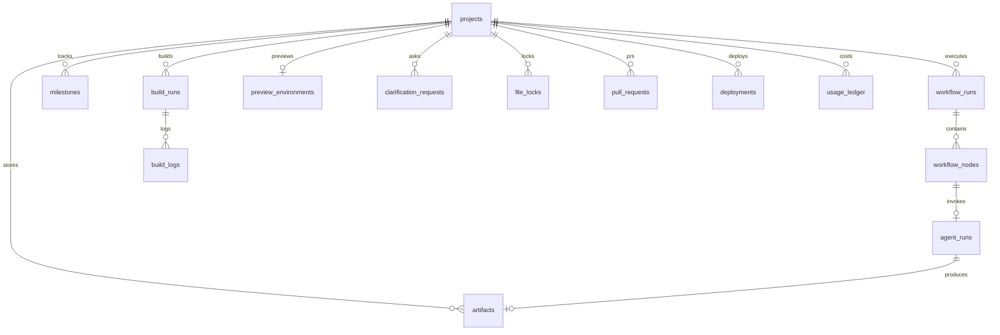

# Database Updates (v2)

## Schema Evolution Strategy

- Phase 1 tables are **extended**, not replaced
- New tables added for workflow, artifacts, sandbox, preview
- Enums expanded via `ALTER TYPE ... ADD VALUE`
- Full v2 DDL: [`packages/database/schema-v2.sql`](../../packages/database/schema-v2.sql)

## ER Diagram (v2 Additions)



## Enum Updates

```sql
-- Expand project lifecycle
ALTER TYPE project_status ADD VALUE 'gathering_requirements';
ALTER TYPE project_status ADD VALUE 'awaiting_clarification';
ALTER TYPE project_status ADD VALUE 'architecting';
ALTER TYPE project_status ADD VALUE 'generating';
ALTER TYPE project_status ADD VALUE 'testing';
ALTER TYPE project_status ADD VALUE 'deploying';
ALTER TYPE project_status ADD VALUE 'preview_ready';

-- Expand agent types
ALTER TYPE agent_type ADD VALUE 'requirements';
ALTER TYPE agent_type ADD VALUE 'planning';
ALTER TYPE agent_type ADD VALUE 'architecture';
ALTER TYPE agent_type ADD VALUE 'ui_generation';
ALTER TYPE agent_type ADD VALUE 'backend_generation';
ALTER TYPE agent_type ADD VALUE 'database';
ALTER TYPE agent_type ADD VALUE 'testing';
ALTER TYPE agent_type ADD VALUE 'refactoring';
ALTER TYPE agent_type ADD VALUE 'deployment';
ALTER TYPE agent_type ADD VALUE 'github';
ALTER TYPE agent_type ADD VALUE 'review';
```

## New Tables

### `workflow_runs`

Tracks DAG workflow execution (one per build attempt).

| Column | Type | Notes |
|--------|------|-------|
| `id` | UUID | PK |
| `project_id` | UUID | FK → projects |
| `workflow_id` | VARCHAR | e.g. `full-app-build` |
| `workflow_version` | INTEGER | DAG version |
| `status` | ENUM | `running`, `paused`, `completed`, `failed`, `cancelled` |
| `current_node_id` | VARCHAR | Active DAG node |
| `artifact_pins` | JSONB | Pinned artifact versions at start |
| `paused_reason` | VARCHAR | Gate type if paused |
| `started_at` | TIMESTAMPTZ | |
| `completed_at` | TIMESTAMPTZ | |

### `workflow_nodes`

Individual steps within a workflow run.

| Column | Type | Notes |
|--------|------|-------|
| `id` | UUID | PK |
| `workflow_run_id` | UUID | FK |
| `node_id` | VARCHAR | DAG node identifier |
| `agent_type` | ENUM | Agent or `sandbox_build`, `preview_deploy` |
| `status` | ENUM | `pending`, `running`, `completed`, `failed`, `skipped` |
| `agent_run_id` | UUID | FK → agent_runs (nullable for sandbox nodes) |
| `build_run_id` | UUID | FK → build_runs (nullable) |
| `depends_on` | UUID[] | Completed predecessor node IDs |
| `started_at` | TIMESTAMPTZ | |
| `completed_at` | TIMESTAMPTZ | |
| `error_message` | TEXT | |

### `artifacts`

Versioned structured agent outputs.

| Column | Type | Notes |
|--------|------|-------|
| `id` | UUID | PK |
| `project_id` | UUID | FK |
| `type` | VARCHAR | `specification`, `roadmap`, `architecture`, etc. |
| `version` | INTEGER | Incrementing per type per project |
| `agent_run_id` | UUID | FK → agent_runs |
| `content` | JSONB | Validated artifact payload |
| `content_hash` | TEXT | SHA-256 for dedup |
| `storage_key` | TEXT | S3 key if content > 1MB |
| `created_at` | TIMESTAMPTZ | |

**Unique:** `(project_id, type, version)`

### `milestones`

Planner output — coarser than tasks.

| Column | Type | Notes |
|--------|------|-------|
| `id` | UUID | PK |
| `project_id` | UUID | FK |
| `workflow_run_id` | UUID | FK |
| `title` | VARCHAR | |
| `description` | TEXT | |
| `phase` | VARCHAR | Foundation, Core, Polish |
| `sort_order` | INTEGER | |
| `status` | ENUM | Same as task_status |
| `dependencies` | UUID[] | Milestone IDs |
| `estimated_complexity` | ENUM | `low`, `medium`, `high` |
| `agent_types` | TEXT[] | Agents invoked for this milestone |

### `clarification_requests`

Requirements agent Q&A.

| Column | Type | Notes |
|--------|------|-------|
| `id` | UUID | PK |
| `project_id` | UUID | FK |
| `workflow_run_id` | UUID | FK |
| `agent_run_id` | UUID | FK |
| `round` | INTEGER | 1, 2, 3 |
| `questions` | JSONB | `[{ id, text, options?, required }]` |
| `answers` | JSONB | `[{ questionId, answer }]` |
| `status` | ENUM | `pending`, `answered`, `expired` |
| `expires_at` | TIMESTAMPTZ | Auto-proceed after 24h |

### `build_runs`

Sandbox build/test execution.

| Column | Type | Notes |
|--------|------|-------|
| `id` | UUID | PK |
| `project_id` | UUID | FK |
| `workflow_node_id` | UUID | FK |
| `type` | ENUM | `build`, `test`, `lint` |
| `status` | ENUM | `queued`, `running`, `passed`, `failed` |
| `sandbox_id` | VARCHAR | Container identifier |
| `duration_ms` | INTEGER | |
| `exit_code` | INTEGER | |
| `error_summary` | TEXT | Plain-English summary |
| `artifacts_path` | TEXT | S3 path to build output |

### `build_logs`

Streaming build output (separate table to avoid bloating build_runs).

| Column | Type | Notes |
|--------|------|-------|
| `id` | BIGSERIAL | PK |
| `build_run_id` | UUID | FK |
| `line_number` | INTEGER | |
| `level` | ENUM | `info`, `warn`, `error` |
| `message` | TEXT | Sanitized (no secrets) |
| `created_at` | TIMESTAMPTZ | |

### `preview_environments`

| Column | Type | Notes |
|--------|------|-------|
| `id` | UUID | PK |
| `project_id` | UUID | FK, unique (one active per project) |
| `url` | TEXT | Public preview URL |
| `internal_url` | TEXT | Container internal |
| `sandbox_id` | VARCHAR | |
| `status` | ENUM | `provisioning`, `ready`, `updating`, `stopped`, `error` |
| `last_activity_at` | TIMESTAMPTZ | For TTL |
| `expires_at` | TIMESTAMPTZ | |
| `created_at` | TIMESTAMPTZ | |

### `file_locks`

Concurrent write coordination.

| Column | Type | Notes |
|--------|------|-------|
| `id` | UUID | PK |
| `project_id` | UUID | FK |
| `path_pattern` | TEXT | Glob pattern |
| `holder_type` | ENUM | Agent type or `integration` |
| `holder_id` | UUID | agent_run_id or build_run_id |
| `acquired_at` | TIMESTAMPTZ | |
| `expires_at` | TIMESTAMPTZ | Auto-release after 30 min |

### `pull_requests`

| Column | Type | Notes |
|--------|------|-------|
| `id` | UUID | PK |
| `project_id` | UUID | FK |
| `github_pr_number` | INTEGER | |
| `github_url` | TEXT | |
| `title` | VARCHAR | |
| `source_branch` | VARCHAR | |
| `target_branch` | VARCHAR | |
| `status` | ENUM | `open`, `merged`, `closed` |
| `milestone_id` | UUID | FK → milestones |
| `agent_run_id` | UUID | FK |

### `deployments`

| Column | Type | Notes |
|--------|------|-------|
| `id` | UUID | PK |
| `project_id` | UUID | FK |
| `environment` | ENUM | `preview`, `staging`, `production` |
| `status` | ENUM | `pending`, `deploying`, `live`, `failed`, `rolled_back` |
| `url` | TEXT | |
| `config` | JSONB | Deploy manifest |
| `deployed_at` | TIMESTAMPTZ | |

### `usage_ledger`

Granular cost tracking.

| Column | Type | Notes |
|--------|------|-------|
| `id` | UUID | PK |
| `user_id` | UUID | FK |
| `project_id` | UUID | FK |
| `agent_run_id` | UUID | FK |
| `provider` | ENUM | llm_provider |
| `model` | VARCHAR | |
| `tokens_input` | INTEGER | |
| `tokens_output` | INTEGER | |
| `cost_usd` | DECIMAL(10,6) | |
| `category` | ENUM | `llm`, `sandbox`, `storage`, `preview` |
| `created_at` | TIMESTAMPTZ | |

### `model_routing_config`

Per-project model overrides.

| Column | Type | Notes |
|--------|------|-------|
| `id` | UUID | PK |
| `project_id` | UUID | FK, unique |
| `defaults` | JSONB | `{ "planning": { "provider": "anthropic", "model": "..." } }` |
| `fallback_chain` | JSONB | Ordered provider list |
| `cost_ceiling_usd` | DECIMAL | Project budget |
| `updated_at` | TIMESTAMPTZ | |

## Modified Tables

### `projects` (new columns)

| Column | Type | Notes |
|--------|------|-------|
| `workflow_status` | ENUM | Mirrors active workflow run status |
| `specification_version` | INTEGER | Latest spec artifact version |
| `preview_url` | TEXT | Denormalized from preview_environments |
| `total_cost_usd` | DECIMAL | Denormalized sum from usage_ledger |
| `complexity` | ENUM | `simple`, `medium`, `complex` (set by planner) |
| `app_category` | VARCHAR | marketplace, pos, crm, saas, etc. |

### `agent_runs` (new columns)

| Column | Type | Notes |
|--------|------|-------|
| `workflow_node_id` | UUID | FK → workflow_nodes |
| `milestone_id` | UUID | FK → milestones |
| `artifact_ids` | UUID[] | Artifacts produced |
| `model_routing_reason` | VARCHAR | Why this model was chosen |
| `files_written` | INTEGER | Count |
| `files_read` | INTEGER | Count |

### `tasks` → deprecated

Tasks table retained for backward compatibility. v2 uses `milestones` for user-facing progress and `workflow_nodes` for execution tracking. Tasks populated as expanded view of milestones for UI task board.

## Index Strategy (v2)

| Query Pattern | Index |
|--------------|-------|
| Active workflow for project | `(project_id, status) WHERE status = 'running'` |
| Latest artifact by type | `(project_id, type, version DESC)` |
| Pending clarifications | `(project_id, status) WHERE status = 'pending'` |
| Active preview | `(project_id) WHERE status = 'ready'` |
| Cost aggregation | `(project_id, created_at)` on usage_ledger |
| Build history | `(project_id, created_at DESC)` on build_runs |

## Data Migration from Phase 1

```sql
-- Map old project statuses
UPDATE projects SET status = 'generating' WHERE status = 'building';
UPDATE projects SET status = 'architecting' WHERE status = 'planning';

-- Migrate project_memory → artifacts
INSERT INTO artifacts (project_id, type, version, content, content_hash, created_at)
SELECT project_id, key, 1, value, encode(sha256(value::text::bytea), 'hex'), created_at
FROM project_memory;
```

## Partitioning (at scale, Year 2+)

| Table | Strategy | When |
|-------|----------|------|
| `orchestration_events` | Range by `created_at` monthly | >100M rows |
| `build_logs` | Range by `created_at` weekly | >50M rows |
| `usage_ledger` | Range by `created_at` monthly | >10M rows |
