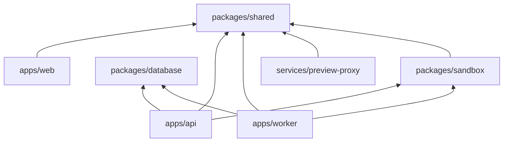

# Folder Structure (v2)

Extends Phase 1 monorepo with platform services, sandbox runtime, and workflow engine.

```
nebula-ai/
├── apps/
│   ├── web/                                 # Next.js — Live Workspace
│   │   ├── src/
│   │   │   ├── app/
│   │   │   │   ├── (auth)/
│   │   │   │   ├── (dashboard)/
│   │   │   │   │   ├── projects/
│   │   │   │   │   │   ├── new/             # Prompt input
│   │   │   │   │   │   └── [id]/
│   │   │   │   │   │       ├── page.tsx     # Workspace shell
│   │   │   │   │   │       ├── chat/
│   │   │   │   │   │       ├── files/
│   │   │   │   │   │       ├── tasks/       # Milestone board
│   │   │   │   │   │       ├── preview/     # Full-screen preview
│   │   │   │   │   │       ├── builds/      # Build history
│   │   │   │   │   │       ├── artifacts/   # Spec, architecture viewer
│   │   │   │   │   │       └── settings/    # Model config, GitHub
│   │   │   │   │   └── layout.tsx
│   │   │   │   └── page.tsx                 # Landing + examples
│   │   │   ├── components/
│   │   │   │   ├── ui/                      # shadcn/ui
│   │   │   │   ├── workspace/
│   │   │   │   │   ├── WorkspaceLayout.tsx  # 4-panel layout
│   │   │   │   │   ├── ChatPanel.tsx
│   │   │   │   │   ├── FileTree.tsx
│   │   │   │   │   ├── CodeEditor.tsx
│   │   │   │   │   ├── PreviewFrame.tsx     # Sandboxed iframe
│   │   │   │   │   ├── AgentTimeline.tsx    # Agent activity feed
│   │   │   │   │   ├── MilestoneBoard.tsx
│   │   │   │   │   ├── BuildStatus.tsx
│   │   │   │   │   ├── GitHubStatus.tsx
│   │   │   │   │   ├── CostMeter.tsx
│   │   │   │   │   ├── PipelineView.tsx     # DAG visualization
│   │   │   │   │   └── ClarificationCard.tsx
│   │   │   │   ├── artifacts/
│   │   │   │   │   ├── SpecViewer.tsx
│   │   │   │   │   ├── ArchitectureViewer.tsx
│   │   │   │   │   └── ApiContractViewer.tsx
│   │   │   │   └── project/
│   │   │   │       ├── ProjectCreateForm.tsx
│   │   │   │       └── ModelSelector.tsx    # Fast vs Best quality
│   │   │   ├── hooks/
│   │   │   │   ├── useOrchestration.ts      # WebSocket events
│   │   │   │   ├── usePreview.ts
│   │   │   │   ├── useBuild.ts
│   │   │   │   └── useArtifacts.ts
│   │   │   └── stores/
│   │   │       ├── workspace-store.ts       # Panel state, active file
│   │   │       └── orchestration-store.ts   # Agent events, pipeline
│   │   └── package.json
│   │
│   ├── api/                                 # Control Plane API
│   │   ├── src/
│   │   │   ├── routes/                      # REST endpoints (v2)
│   │   │   ├── controllers/
│   │   │   ├── services/
│   │   │   │   ├── auth.service.ts
│   │   │   │   ├── project.service.ts
│   │   │   │   ├── artifact.service.ts      # NEW
│   │   │   │   ├── memory.service.ts
│   │   │   │   ├── vfs.service.ts
│   │   │   │   ├── workflow.service.ts      # NEW
│   │   │   │   ├── preview.service.ts       # NEW
│   │   │   │   ├── build.service.ts         # NEW
│   │   │   │   ├── github.service.ts
│   │   │   │   ├── billing.service.ts       # NEW
│   │   │   │   └── event.service.ts
│   │   │   ├── orchestration/
│   │   │   │   ├── engine.ts
│   │   │   │   ├── workflow-engine.ts       # NEW — DAG executor
│   │   │   │   ├── context-builder.ts
│   │   │   │   ├── file-lock-manager.ts     # NEW
│   │   │   │   └── blackboard.ts            # NEW
│   │   │   ├── agents/
│   │   │   │   ├── base-agent.ts
│   │   │   │   ├── requirements.agent.ts    # NEW
│   │   │   │   ├── planning.agent.ts
│   │   │   │   ├── architecture.agent.ts    # NEW
│   │   │   │   ├── ui-generation.agent.ts   # NEW
│   │   │   │   ├── backend-generation.agent.ts # NEW
│   │   │   │   ├── database.agent.ts        # NEW
│   │   │   │   ├── testing.agent.ts         # NEW
│   │   │   │   ├── refactoring.agent.ts     # NEW
│   │   │   │   ├── deployment.agent.ts      # NEW
│   │   │   │   ├── github.agent.ts          # NEW
│   │   │   │   ├── review.agent.ts          # NEW
│   │   │   │   ├── prompts/                 # Per-agent system prompts
│   │   │   │   └── tools/
│   │   │   ├── llm/
│   │   │   │   ├── provider.interface.ts
│   │   │   │   ├── model-router.ts          # NEW
│   │   │   │   ├── provider.factory.ts
│   │   │   │   └── providers/
│   │   │   ├── websocket/
│   │   │   └── middleware/
│   │   └── package.json
│   │
│   └── worker/                              # NEW — Agent + Sandbox Workers
│       ├── src/
│       │   ├── index.ts                     # Worker entry (queue selector)
│       │   ├── processors/
│       │   │   ├── agent-run.processor.ts
│       │   │   ├── sandbox-build.processor.ts
│       │   │   ├── sandbox-test.processor.ts
│       │   │   ├── preview.processor.ts
│       │   │   └── ops.processor.ts
│       │   └── health.ts
│       └── package.json
│
├── packages/
│   ├── database/
│   │   ├── schema.sql                       # Phase 1 base
│   │   ├── schema-v2.sql                    # Platform extensions
│   │   └── prisma/
│   │       └── schema.prisma
│   │
│   ├── shared/
│   │   ├── src/
│   │   │   ├── types/
│   │   │   │   ├── agent.ts
│   │   │   │   ├── artifact.ts              # NEW — typed artifact schemas
│   │   │   │   ├── workflow.ts              # NEW — DAG types
│   │   │   │   ├── event.ts                 # NEW — event envelope
│   │   │   │   └── sandbox.ts               # NEW
│   │   │   ├── schemas/                     # Zod validation
│   │   │   │   ├── artifacts/               # Per-artifact-type schemas
│   │   │   │   │   ├── specification.ts
│   │   │   │   │   ├── roadmap.ts
│   │   │   │   │   ├── architecture.ts
│   │   │   │   │   └── api-contract.ts
│   │   │   │   └── events/
│   │   │   ├── constants/
│   │   │   │   ├── events.ts
│   │   │   │   ├── agent-routing.ts         # NEW — default model map
│   │   │   │   └── file-ownership.ts        # NEW — path → agent map
│   │   │   └── workflows/                   # NEW — DAG definitions
│   │   │       ├── full-app-build.yaml
│   │   │       └── iteration-build.yaml
│   │   └── package.json
│   │
│   ├── sandbox/                             # NEW — Execution Plane SDK
│   │   ├── src/
│   │   │   ├── manager.ts                   # Create/destroy sandboxes
│   │   │   ├── runtime/
│   │   │   │   ├── docker.runtime.ts        # Dev
│   │   │   │   └── firecracker.runtime.ts   # Prod
│   │   │   ├── builder.ts                   # npm install + build
│   │   │   ├── tester.ts                    # npm test
│   │   │   └── preview.ts                   # dev server manager
│   │   └── package.json
│   │
│   └── config/                              # Shared ESLint, TS, Tailwind
│
├── services/
│   └── preview-proxy/                       # NEW — Reverse proxy for previews
│       ├── src/
│       │   ├── router.ts                    # UUID subdomain → container
│       │   └── middleware.ts                # noindex, rate limit
│       └── Dockerfile
│
├── infrastructure/
│   ├── docker/
│   │   ├── Dockerfile.api
│   │   ├── Dockerfile.web
│   │   ├── Dockerfile.worker
│   │   ├── Dockerfile.sandbox-base          # NEW — Base sandbox image
│   │   └── Dockerfile.preview-proxy
│   ├── docker-compose.yml
│   ├── k8s/                                 # NEW — Production manifests
│   │   ├── api/
│   │   ├── worker/
│   │   ├── sandbox-operator/
│   │   └── preview-proxy/
│   └── terraform/
│
├── docs/
│   ├── architecture/                        # Phase 1 docs (retained)
│   └── platform/                            # v2 platform docs (this set)
│
├── .github/workflows/
│   ├── ci.yml
│   └── deploy.yml
│
├── turbo.json
├── pnpm-workspace.yaml
└── package.json
```

## Package Dependency Graph



## Key Additions from Phase 1

| Addition | Purpose |
|----------|---------|
| `apps/worker` | Separate process for agent/sandbox execution |
| `packages/sandbox` | Execution plane SDK (Docker/Firecracker) |
| `packages/shared/workflows/` | Declarative DAG definitions |
| `packages/shared/schemas/artifacts/` | Typed artifact validation |
| `services/preview-proxy` | Route `*.preview.nebula.ai` to containers |
| `infrastructure/k8s/` | Production orchestration |

## Workspace UI Layout

```
┌──────────────────────────────────────────────────────────────────┐
│ Header: Project Name | Status | Cost Meter | GitHub | Preview btn │
├────────────┬─────────────────────────────┬───────────────────────┤
│            │                             │                       │
│  File Tree │     Code Editor / Preview   │    Chat Panel         │
│  (240px)   │         (flex 1)            │    (360px)            │
│            │                             │                       │
│  ───────── │                             │  ─────────────────── │
│  Milestones│                             │  Agent Timeline       │
│  (bottom)  │                             │  (bottom)             │
│            │                             │                       │
├────────────┴─────────────────────────────┴───────────────────────┤
│ Pipeline: ● Requirements → ● Planning → ◉ Architecture → ○ ... │
└──────────────────────────────────────────────────────────────────┘
```

## Conventions (unchanged from Phase 1)

- pnpm workspaces + Turborepo
- Path aliases: `@nebula/shared`, `@nebula/database`, `@nebula/sandbox`
- Co-located tests: `*.test.ts`
- No circular package dependencies
- Environment: `.env` (api/worker), `.env.local` (web)
