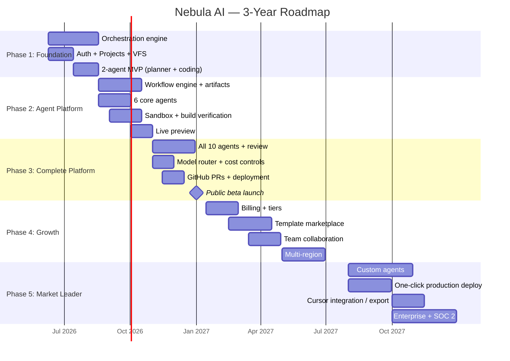

# Production Roadmap (3-Year)

## Strategic Phases

---

## Phase 1: Foundation (Jun–Aug 2026) — 10 weeks

**Goal:** Working orchestration engine. Internal alpha.

| Week | Deliverable | Success Criteria |
|------|-------------|-----------------|
| 1-2 | Monorepo, Docker, CI, DB migrations | `docker compose up` works |
| 3 | Auth (email + Google OAuth) | Register → login → dashboard |
| 4 | Project CRUD + chat | Create project with prompt |
| 5 | VFS + file tree UI | Files created/read/versioned |
| 6 | LLM provider layer (4 providers) | Unified interface, token tracking |
| 7-8 | Planner + Coding agents | Prompt → tasks → files |
| 9 | WebSocket + agent activity UI | Real-time file updates |
| 10 | GitHub push + polish | Code in user's GitHub repo |

**Team:** 2 full-stack engineers  
**Users:** Internal only (10 testers)  
**Metrics:** 1 complete app generated end-to-end

---

## Phase 2: Agent Platform (Aug–Nov 2026) — 12 weeks

**Goal:** Multi-agent pipeline with verified builds and live preview.

| Week | Deliverable | Success Criteria |
|------|-------------|-----------------|
| 1-2 | Workflow engine (DAG) + artifact registry | Declarative pipeline executes |
| 3-4 | Requirements agent + clarification UI | Agent asks questions, user answers |
| 5-6 | Planning + Architecture agents | Spec → roadmap → architecture artifacts |
| 7-8 | UI + Backend + Database agents (parallel) | 3 agents write non-overlapping files |
| 9-10 | Sandbox executor + build integration | `npm run build` passes in container |
| 11-12 | Live preview + Pipeline UI | User sees running app in iframe |

**Team:** +1 AI engineer, +1 DevOps  
**Users:** Private beta (100 users)  
**Metrics:**
- 80% of projects compile on first build
- Preview ready < 60 seconds after generation
- Requirements agent asks relevant questions 90% of the time

---

## Phase 3: Complete Platform (Nov 2026–Jan 2027) — 10 weeks

**Goal:** All 10 agents, public beta launch.

| Week | Deliverable | Success Criteria |
|------|-------------|-----------------|
| 1-2 | Testing + Refactoring agents | Tests generated, failures auto-fixed (≤3 loops) |
| 3-4 | Review agent + quality gate | Review blocks bad code from GitHub |
| 5-6 | Model router + cost controls | Per-agent routing, budget enforcement |
| 7-8 | Deployment agent + GitHub PRs | CI/CD config generated, PRs created |
| 9-10 | Launch prep: security audit, docs, onboarding | Public beta ready |

**Launch criteria:**
- [ ] "Build an Airbnb clone" produces working marketplace app
- [ ] "Build a restaurant POS" produces working POS system
- [ ] "Build a CRM" produces working CRM with auth
- [ ] Non-technical user completes flow without help
- [ ] Cost per medium project < $5
- [ ] Preview uptime > 99%

**Team:** 6 engineers + 1 designer + 1 PM  
**Users:** Public beta (5K users)  
**Revenue:** Free tier only

---

## Phase 4: Growth (Jan–Aug 2027) — 8 months

**Goal:** Monetization, templates, teams. 50K users.

| Month | Deliverable |
|-------|-------------|
| Jan-Feb | Stripe billing (Free/Pro/Team), usage metering |
| Feb-Mar | Template marketplace (10 starter templates) |
| Mar-Apr | Team collaboration (shared projects, roles) |
| Apr-May | Iteration workflow ("add feature to existing project") |
| May-Jun | Multi-region (US + EU) |
| Jun-Jul | Mobile-responsive preview + PWA support |
| Jul-Aug | Analytics dashboard for generated apps |

**Revenue targets:**
- 50K registered users
- 8% Pro conversion (4K paying)
- $116K MRR
- 65% gross margin

---

## Phase 5: Market Leader (Aug 2027–2028) — 12 months

**Goal:** Compete directly with Lovable, Bolt, Replit Agent. 500K users.

| Quarter | Deliverable |
|---------|-------------|
| Q3 2027 | Custom agent builder (power users) |
| Q3 2027 | One-click production deploy (Vercel/Netlify/Railway) |
| Q4 2027 | "Export to Cursor" — open project in IDE |
| Q4 2027 | SOC 2 Type I certification |
| Q1 2028 | Database agent: live migrations on preview DB |
| Q1 2028 | Multi-agent parallel execution (3x speed) |
| Q2 2028 | Enterprise tier (SSO, audit logs, SLA) |
| Q2 2028 | SOC 2 Type II |

**Revenue targets:**
- 500K registered users
- 10% paid conversion
- $1.5M MRR
- Enterprise deals: 20 accounts

---

## Competitive Milestones

| Date | Milestone | vs Competitors |
|------|-----------|---------------|
| Jan 2027 | Public beta | Feature parity with Bolt (preview) |
| Jun 2027 | Templates + billing | Feature parity with Lovable (monetization) |
| Dec 2027 | Production deploy | Ahead of Bolt (deployment) |
| Jun 2028 | Custom agents + IDE export | Unique positioning vs all |

## Key Risks & Mitigations

| Risk | Probability | Impact | Mitigation |
|------|------------|--------|------------|
| LLM quality insufficient for complex apps | Medium | High | Multi-model routing, reviewer agent, human gates |
| Preview costs unsustainable | Medium | High | Aggressive TTL, tiered sandbox, CDN caching |
| Competitor launches similar multi-agent | High | Medium | Speed to market, template moat, cost transparency |
| Sandbox security incident | Low | Critical | Firecracker, security audits, bug bounty |
| Low Pro conversion | Medium | High | Templates showcase value, preview as hook |
| LLM provider price increases | Medium | Medium | Multi-provider, DeepSeek for cost, pass-through pricing |

## Hiring Plan

| Phase | Role | Count |
|-------|------|-------|
| Phase 1 | Full-stack engineer | 2 |
| Phase 2 | + AI/ML engineer, DevOps | +2 |
| Phase 3 | + Frontend, Designer, PM | +3 |
| Phase 4 | + Backend, Growth, Support | +3 |
| Phase 5 | + Security, Enterprise sales, ML research | +4 |
| **Year 3 total** | | **14** |

## Investment Requirements

| Phase | Duration | Team Cost | Infra/mo | LLM/mo | Total |
|-------|----------|-----------|----------|--------|-------|
| Phase 1-2 | 5 months | $150K | $2K | $5K | $185K |
| Phase 3 | 3 months | $120K | $5K | $15K | $165K |
| Phase 4 | 8 months | $400K | $15K | $50K | $720K |
| Phase 5 | 12 months | $800K | $50K | $200K | $2.35M |
| **3-Year Total** | | | | | **~$3.4M** |

Seed round target: **$4-5M** to reach profitability at Phase 4 conversion rates.

## Definition of Done: "Complete Working Application"

A project is **complete** when ALL of the following are true:

1. Requirements artifact has zero unresolved questions
2. Architecture artifact defines full stack
3. VFS contains all files for a buildable project
4. `npm run build` passes in sandbox
5. `npm test` passes (≥80% of generated tests)
6. Review agent reports `passed`
7. Code pushed to GitHub on `main` branch
8. Preview environment shows functional application
9. User can interact with core features in preview
10. Total cost within project budget

This is the bar. Anything less is a failed build.
