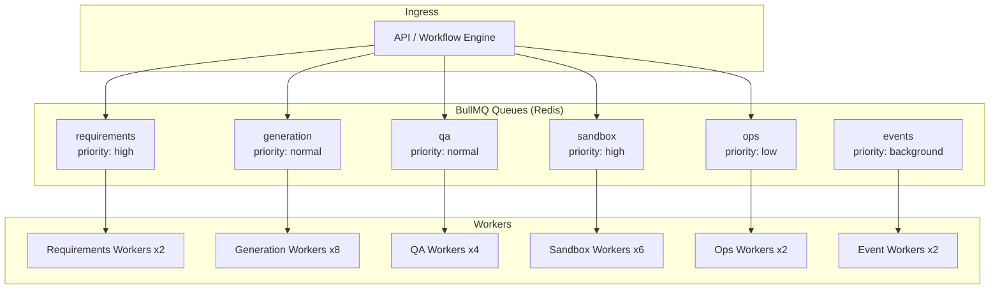
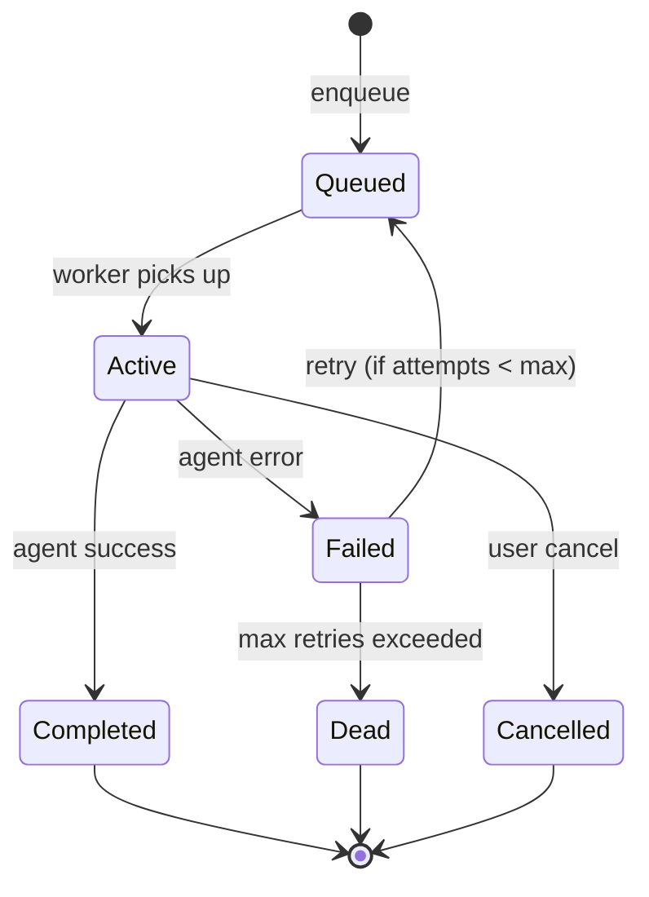
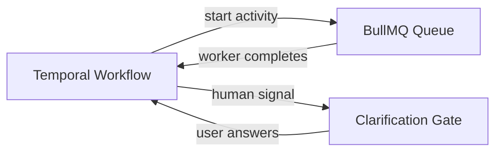

# Queue & Worker Architecture

## Problem with Phase 1

Single `agent-runs` queue with concurrency 3:
- Coding agent blocks requirements clarification
- GitHub push blocks code generation
- No priority for paying users
- No isolation between agent classes

## v2 Design: Tiered Queue System



## Queue Definitions

| Queue | Job Types | Default Concurrency | Timeout | Retries |
|-------|-----------|-------------------|---------|---------|
| `requirements` | Requirements agent, clarification resume | 2 | 5 min | 2 |
| `generation` | Planning, Architecture, UI, Backend, Database | 8 | 15 min | 3 |
| `qa` | Testing, Refactoring, Review | 4 | 20 min | 2 |
| `sandbox` | Build, test, lint, preview provision | 6 | 10 min | 1 |
| `ops` | GitHub, Deployment | 2 | 5 min | 3 |
| `events` | Audit write, metrics, archive | 2 | 1 min | 5 |

## Job Schema

```typescript
interface AgentJob {
  id: string;
  queue: QueueName;
  priority: number;                    // 1 (highest) to 10 (lowest)
  data: {
    workflowRunId: string;
    workflowNodeId: string;
    projectId: string;
    userId: string;
    agentType: AgentType;
    modelConfig: ModelAssignment;
    contextPackage: AgentContext;      // Pre-assembled by orchestrator
    artifactPins: ArtifactPinSet;
    fileLockPatterns: string[];
    attempt: number;
  };
  opts: {
    jobId: string;                     // Idempotency: workflowNodeId
    removeOnComplete: 100;
    removeOnFail: 500;
  };
}

interface SandboxJob {
  id: string;
  queue: "sandbox";
  data: {
    buildRunId: string;
    projectId: string;
    type: "build" | "test" | "lint" | "preview";
    vfsSnapshotId: string;             // Point-in-time VFS snapshot
    timeout: number;
  };
}
```

## Worker Process Architecture

```
┌─────────────────────────────────────────────────┐
│ Worker Pod                                       │
│                                                  │
│  ┌──────────────┐  ┌──────────────────────────┐ │
│  │ Queue Worker │  │ Agent Runtime            │ │
│  │ (BullMQ)     │──│ - BaseAgent instances    │ │
│  │              │  │ - Tool registry          │ │
│  │              │  │ - LLM provider pool      │ │
│  └──────────────┘  └──────────────────────────┘ │
│                                                  │
│  ┌──────────────┐  ┌──────────────────────────┐ │
│  │ Health Check │  │ Metrics Exporter         │ │
│  └──────────────┘  └──────────────────────────┘ │
└─────────────────────────────────────────────────┘
```

**Deployment modes:**

| Mode | Processes | Use |
|------|-----------|-----|
| `worker-generation` | Generation queue only | Scale code gen independently |
| `worker-qa` | QA + Sandbox queues | Scale verification independently |
| `worker-ops` | Ops queue | Low volume, always on |
| `worker-all` | All queues | Development only |

## Job Lifecycle



## Priority System

```typescript
function calculatePriority(job: AgentJob): number {
  let priority = 5; // default

  // Paying users get higher priority
  if (job.data.userTier === 'pro') priority -= 2;
  if (job.data.userTier === 'team') priority -= 3;

  // Requirements/clarification always high
  if (job.data.agentType === 'requirements') priority = 1;

  // Retries are lower priority
  priority += job.data.attempt;

  return Math.max(1, Math.min(10, priority));
}
```

## Sandbox Worker (Distinct from Agent Workers)

Sandbox workers do NOT call LLMs. They manage containers:

```typescript
class SandboxWorker {
  async processBuild(job: SandboxJob): Promise<BuildResult> {
    const sandbox = await this.sandboxManager.create({
      projectId: job.data.projectId,
      snapshotId: job.data.vfsSnapshotId,
      limits: { cpu: 2, memoryMb: 4096, timeoutSec: 600 },
    });

    try {
      await sandbox.writeFiles(await vfs.getSnapshot(job.data.vfsSnapshotId));
      await sandbox.exec('npm install --prefer-offline');
      const result = await sandbox.exec('npm run build');
      return { success: result.exitCode === 0, logs: result.stdout };
    } finally {
      if (job.data.type !== 'preview') {
        await sandbox.destroy();
      }
    }
  }
}
```

**Preview sandboxes** are long-lived (not destroyed after build). Managed by Preview Manager service.

## Temporal.io Integration (Production)

BullMQ handles job dispatch; Temporal handles workflow durability:



| Concern | BullMQ | Temporal |
|---------|--------|----------|
| Job dispatch | ✓ | |
| Retry with backoff | ✓ | |
| Durable workflow state | | ✓ |
| Human-in-the-loop signals | | ✓ |
| Workflow visibility UI | | ✓ |
| Exactly-once node execution | | ✓ |

**Migration path:** Start with BullMQ only (MVP). Add Temporal when human gates and long-running workflows become painful.

## Backpressure

When queues exceed thresholds:

| Queue Depth | Action |
|-------------|--------|
| > 50 | Warn ops, scale workers |
| > 200 | Throttle new project creation |
| > 500 | Reject non-Pro enqueue, show queue ETA |
| Sandbox > 20 | Queue builds, show "build queued" in UI |

## Dead Letter Handling

Failed jobs after max retries go to DLQ:

```
1. Write to dead_letter_jobs table
2. Emit agent.run.failed with retryable: false
3. Workflow engine marks node as failed
4. User sees: "Generation failed. Retry or contact support."
5. Ops dashboard shows DLQ for manual investigation
```

## Worker Health

| Check | Interval | Failure Action |
|-------|----------|---------------|
| Redis connectivity | 10s | Stop accepting jobs |
| PostgreSQL connectivity | 30s | Stop accepting jobs |
| LLM provider reachable | 60s | Route to fallback |
| Memory usage < 80% | 30s | Stop accepting jobs |
| Active job < timeout | Per job | Kill and retry |

## Local Development

```bash
# Start all workers in one process
pnpm --filter @nebula/api worker:dev

# Start specific pool
WORKER_QUEUES=generation,sandbox pnpm worker:dev

# Start sandbox with Docker (not Firecracker)
SANDBOX_RUNTIME=docker pnpm worker:dev
```
