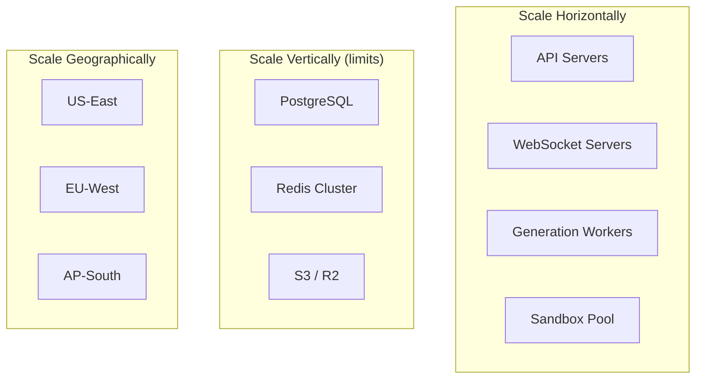
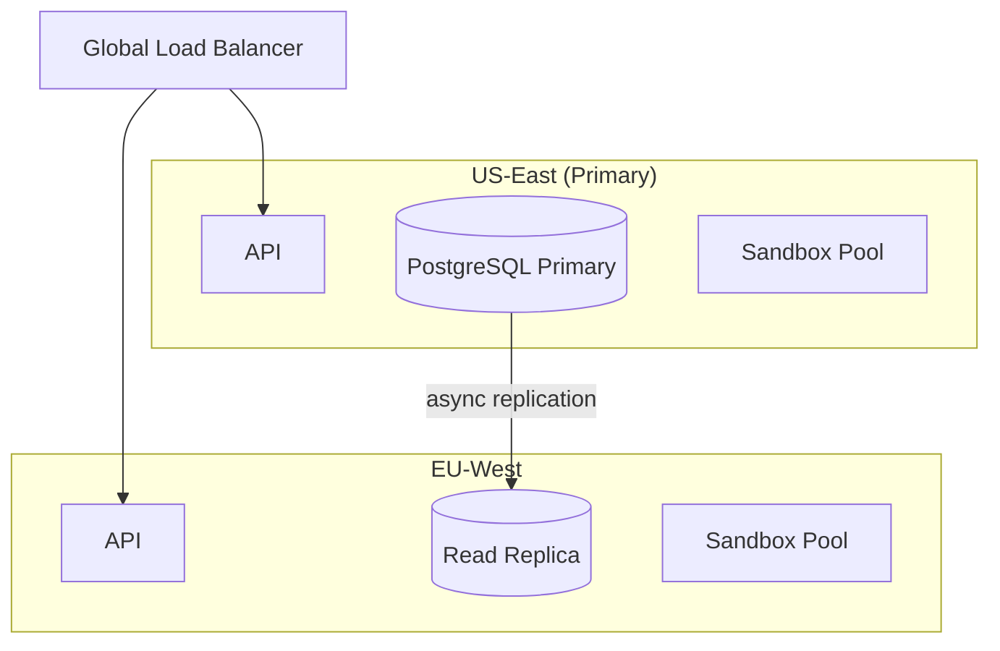

# Scaling Strategy

## Growth Projections

| Milestone | Users | Active Projects | Agent Runs/Day | Previews |
|-----------|-------|----------------|----------------|----------|
| Launch | 1K | 200 | 2K | 100 |
| Year 1 | 50K | 5K | 50K | 2K |
| Year 2 | 500K | 30K | 500K | 15K |
| Year 3 | 2M | 100K | 2M | 50K |

## Scaling Dimensions



## Component Scaling Matrix

| Component | Launch | Year 1 | Year 2 | Year 3 |
|-----------|--------|--------|--------|--------|
| API servers | 2 | 4-8 | 16-32 | Auto-scale 8-64 |
| WebSocket servers | 2 | 4 | 8-16 | Dedicated fleet |
| Generation workers | 4 | 16 | 64 | 200+ spot instances |
| Sandbox containers | 10 | 50 | 200 | 1000+ (regional) |
| PostgreSQL | Single (Neon) | Primary + 1 replica | Primary + 3 replicas | CockroachDB or Citus |
| Redis | Single | Primary + replica | Cluster (6 nodes) | Cluster (12+ nodes) |
| Event bus | Redis Streams | Redis Streams | Kafka | Kafka multi-region |
| Object storage | Single bucket | Per-region buckets | Multi-region replication | CDN-backed |

## Control Plane Scaling

### API Servers (Stateless)

- Fastify behind ALB/nginx
- Auto-scale on CPU (target 60%) and request rate
- No sticky sessions except WebSocket upgrade
- Read queries can route to PostgreSQL replicas

### WebSocket Servers

- Sticky sessions required (project subscription state in-memory)
- Redis pub/sub for cross-server event fanout
- Each server subscribes to `project:{id}` channels for its connected clients
- Scale trigger: connections per server > 5000

```
Client → WS Server A (subscribed to project X)
Event published to Redis Stream project:X
All WS servers receive → only Server A has subscribers → forwards to clients
```

## Agent Plane Scaling

### Generation Workers (Bottleneck at Scale)

Primary cost and throughput bottleneck.

| Strategy | When | Impact |
|----------|------|--------|
| Increase concurrency per worker | Launch | 2x throughput |
| Add worker replicas | >100 concurrent runs | Linear scaling |
| Spot/preemptible instances | Year 1 | 60% cost reduction |
| Agent result caching | Year 2 | Skip re-generation for identical specs |
| Parallel milestone execution | Year 2 | 3x for multi-milestone projects |

**Spot instance handling:**
- Generation workers on spot → graceful shutdown on preemption
- Job returns to queue with `attempt` unchanged (not counted as retry)
- Temporal/BullMQ ensures no lost work

### Sandbox Pool (Second Bottleneck)

Each preview = 1 container (512MB-2GB RAM).

| Strategy | Capacity Impact |
|----------|----------------|
| Pool warm instances | -5s cold start |
| Tiered sandbox sizes (S/M/L) | 2x density for simple apps |
| Preview sharing (static sites) | 10x density |
| Regional pools | Lower latency, distributed load |
| Aggressive TTL (idle 1h → stop) | Free resources |

**Year 3 target:** 50K concurrent previews requires ~25TB RAM across pool. Use regional Kubernetes node pools with sandbox operator.

## Data Plane Scaling

### PostgreSQL

| Phase | Architecture | Connection Pooling |
|-------|-------------|-------------------|
| Launch | Neon serverless, 1 compute unit | PgBouncer (transaction mode) |
| Year 1 | Neon, 4 CU + read replica | PgBouncer per service |
| Year 2 | Partition events/logs tables | Read replicas for analytics |
| Year 3 | Evaluate CockroachDB for multi-region | Per-region pools |

**Query optimization priorities:**
1. Project-scoped queries (always indexed on `project_id`)
2. Avoid JOINs in hot paths (denormalize `preview_url`, `total_cost_usd`)
3. Materialized view for usage dashboards

### Redis

| Phase | Architecture |
|-------|-------------|
| Launch | Single ElastiCache r6g.large |
| Year 1 | Primary + replica, cluster mode |
| Year 2 | 6-node cluster, separate event/log streams |
| Year 3 | Migrate events to Kafka, Redis for cache/locks only |

### Object Storage

- VFS files: S3 Standard → Intelligent Tiering after 30 days
- Build artifacts: S3 Standard, 7-day lifecycle delete
- Event archives: S3 Glacier after 90 days
- Preview bundles: CDN (CloudFront/Cloudflare) in front of S3

## Multi-Region Strategy (Year 2+)



| Data | Multi-Region Strategy |
|------|----------------------|
| User accounts | Primary region, replicated |
| Projects | Region-locked to user's signup region |
| VFS files | Replicated object storage |
| Previews | Always local region (latency) |
| LLM calls | Route to nearest provider endpoint |

## LLM Provider Scaling

| Concern | Strategy |
|---------|----------|
| Rate limits | Multi-key rotation, request queuing |
| Latency | Provider-specific connection pools |
| Outage | Model Router fallback chain |
| Cost at scale | Negotiate enterprise pricing Year 1 |

**Connection pool per provider:**
```
OpenAI: 50 concurrent connections per worker pod
Anthropic: 30 concurrent (lower rate limits)
Gemini: 40 concurrent
DeepSeek: 60 concurrent (higher limits, lower cost)
```

## Cost-Efficient Scaling Principles

1. **Scale workers, not API** — Agent runs are 95% of compute cost
2. **Spot instances for generation** — Interruptible work tolerates preemption
3. **Preview TTL aggressive** — Biggest infra cost per user at scale
4. **Cache artifact schemas** — Reduce DB reads in context builder
5. **Batch GitHub operations** — Combine blob creation into tree API calls
6. **Tiered sandbox** — Simple apps get 512MB, complex get 2GB

## Observability at Scale

| Signal | Tool | Alert Threshold |
|--------|------|----------------|
| Queue depth | Prometheus | > 200 per queue |
| Agent P95 duration | Prometheus | > 10 min |
| Sandbox utilization | Custom | > 85% pool capacity |
| WS connection count | Prometheus | > 80% server capacity |
| DB connection pool | PgBouncer metrics | > 80% utilized |
| LLM error rate | Prometheus | > 5% per provider |
| Preview start P95 | Custom | > 30s |

## Disaster Recovery

| Scenario | RTO | RPO | Recovery |
|----------|-----|-----|----------|
| API region down | 5 min | 0 | DNS failover to secondary region |
| PostgreSQL failure | 15 min | 1 min | Promote replica |
| Redis failure | 5 min | 0 (queues rebuild) | Failover to replica |
| S3 unavailable | 1 min | 0 | Multi-AZ is automatic |
| All LLM providers down | N/A | N/A | Queue jobs, notify users, no data loss |
