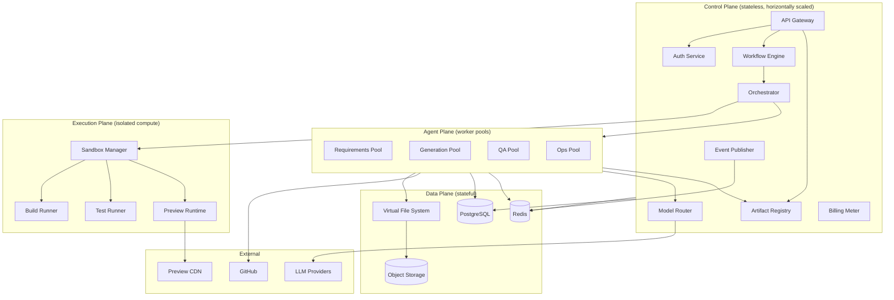
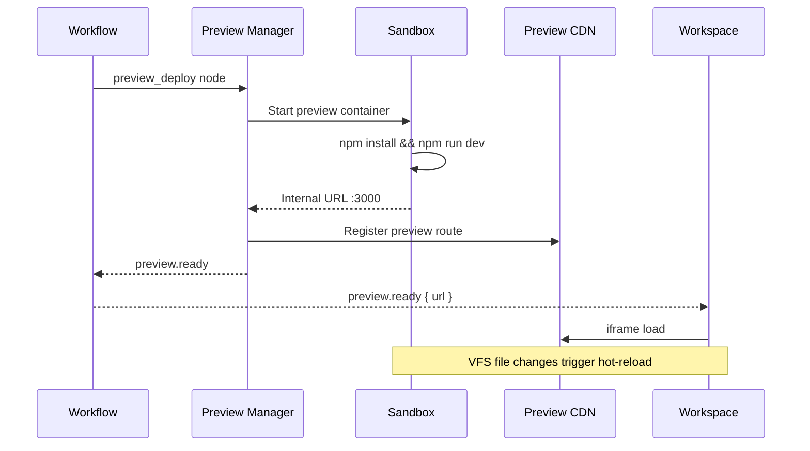

# Complete System Architecture

## Architectural Style

Nebula v2 is a **control plane / data plane split** with an **agent mesh** coordinated by a **DAG workflow engine**.



## Layer Responsibilities

### 1. Experience Layer (Next.js)

The **Live Workspace** — single surface where non-technical users observe and steer generation.

| Panel | Purpose |
|-------|---------|
| **Chat** | Natural language input, clarification answers, steering |
| **Project Tree** | Live file tree with agent attribution badges |
| **Editor** | Read-only during generation; editable when idle |
| **Agent Activity** | Real-time agent timeline with model + cost |
| **Task Progress** | Milestone DAG with completion % |
| **Build Status** | Compile/test pass-fail with error excerpts |
| **GitHub Status** | Branch, commit, PR state |
| **Live Preview** | iframe of running application |

**Design principle:** The user never sees terminal output. Errors are translated to plain English by the Requirements/Review agents.

### 2. Control Plane

| Service | Responsibility |
|---------|---------------|
| **API Gateway** | REST + WebSocket + rate limiting |
| **Auth Service** | Identity, sessions, RBAC (future teams) |
| **Workflow Engine** | DAG definition, execution, human gates, retries |
| **Orchestrator** | Agent dispatch, context assembly, conflict resolution |
| **Artifact Registry** | Versioned structured outputs (spec, API contract, design system) |
| **Model Router** | Per-agent model selection, fallback, cost caps |
| **Event Publisher** | Normalized events to WebSocket + audit log |
| **Billing Meter** | Token/cost ledger per user/project/agent |

### 3. Agent Plane

Ten specialist agents organized into worker pools by resource profile:

| Pool | Agents | Resource Profile |
|------|--------|-----------------|
| **Requirements** | Requirements | Low compute, conversational, human gates |
| **Generation** | Planning, Architecture, UI, Backend, Database | High LLM tokens, file writes |
| **QA** | Testing, Refactoring, Review | LLM + sandbox execution |
| **Ops** | Deployment, GitHub | API calls, infra mutations |

### 4. Data Plane

| Store | Contents |
|-------|----------|
| **PostgreSQL** | Users, projects, workflows, artifacts metadata, agent runs |
| **Redis** | Job queues, pub/sub events, session cache, file locks |
| **S3** | File content >256KB, build artifacts, preview bundles |
| **VFS** | Logical project tree with immutable versioning |

### 5. Execution Plane

**Critical addition.** Without execution, "working application" is a claim, not a guarantee.

| Component | Function |
|-----------|----------|
| **Sandbox Manager** | Provisions isolated containers per project/build |
| **Build Runner** | `npm install && npm run build` |
| **Test Runner** | Unit, integration, e2e test execution |
| **Preview Runtime** | Long-lived dev server with hot-reload from VFS |

**Isolation:** Each sandbox is a Firecracker microVM (production) or Docker container (development) with:
- No network egress except allowlisted registries
- CPU/memory/time limits
- Ephemeral filesystem
- Secrets injected via vault, never written to VFS

## Agent Catalog

### 1. Requirements Agent

| Attribute | Value |
|-----------|-------|
| **Input** | User prompt, conversation history |
| **Output** | `specification` artifact (structured) |
| **Can pause workflow** | Yes — emits `clarification.requested` |
| **Default model** | Claude (nuanced reasoning) |

**Specification artifact schema:**
```typescript
interface Specification {
  version: number;
  appType: string;                    // "marketplace", "pos", "crm"
  targetUsers: string[];
  coreFeatures: Feature[];
  nonFunctional: {
    scale: "prototype" | "production";
    platforms: ("web" | "mobile-responsive")[];
    accessibility: boolean;
  };
  explicitExclusions: string[];
  openQuestions: Clarification[];     // triggers human gate if non-empty
  confidence: number;                 // 0-1; <0.8 → ask questions
}
```

### 2. Planning Agent

| Attribute | Value |
|-----------|-------|
| **Input** | Specification artifact |
| **Output** | `roadmap` artifact with milestone DAG |
| **Default model** | Claude |

Produces milestones (not tasks — that's too granular for planning). Each milestone maps to agent invocations.

### 3. Architecture Agent

| Attribute | Value |
|-----------|-------|
| **Input** | Specification + roadmap |
| **Output** | `architecture` artifact (stack, FE, BE, DB, API) |
| **Default model** | Claude |

**Architecture artifact** is the contract all generation agents must follow. Changes require re-running downstream agents.

### 4. UI Generation Agent

| Attribute | Value |
|-----------|-------|
| **Input** | Architecture artifact, design references |
| **Output** | Frontend files + `design_system` artifact |
| **Default model** | GPT-4o (strong JSX/CSS generation) |

Generates: page hierarchy, components, layouts, Tailwind tokens, dashboards, forms, tables, charts.

### 5. Backend Generation Agent

| Attribute | Value |
|-----------|-------|
| **Input** | Architecture artifact, API contract |
| **Output** | API routes, services, auth, business logic |
| **Default model** | Claude |

### 6. Database Agent

| Attribute | Value |
|-----------|-------|
| **Input** | Architecture artifact, API contract |
| **Output** | Schema, migrations, indexes, seed data |
| **Default model** | DeepSeek (cost-efficient structured SQL) |

Runs in **parallel** with UI and Backend agents after Architecture.

### 7. Testing Agent

| Attribute | Value |
|-----------|-------|
| **Input** | VFS snapshot, architecture artifact |
| **Output** | Test files + `test_report` artifact |
| **Default model** | DeepSeek (test boilerplate) |
| **Requires sandbox** | Yes |

### 8. Refactoring Agent

| Attribute | Value |
|-----------|-------|
| **Input** | VFS, test_report failures, architecture artifact |
| **Output** | Modified files + `refactor_report` artifact |
| **Default model** | Gemini (large context for wide refactors) |
| **Triggered by** | Test failures or Review rejection |

### 9. Deployment Agent

| Attribute | Value |
|-----------|-------|
| **Input** | VFS, architecture artifact |
| **Output** | CI/CD config, env templates, deploy manifests |
| **Default model** | DeepSeek |

### 10. GitHub Agent

| Attribute | Value |
|-----------|-------|
| **Input** | VFS snapshot, milestone metadata |
| **Output** | Repo, branches, commits, PRs |
| **Default model** | None (deterministic API operations) |

### 11. Review Agent (Quality Gate)

| Attribute | Value |
|-----------|-------|
| **Input** | All artifacts, VFS, test_report, build_result |
| **Output** | `review_report` artifact (pass/fail + issues) |
| **Default model** | Claude |
| **Can block workflow** | Yes — routes to Refactoring on fail |

## Workflow DAG Definition

Workflows are declarative YAML/JSON, not hardcoded:

```yaml
id: full-app-build
version: 2
nodes:
  - id: requirements
    agent: requirements
    on: { completed: planning }
    gate: human_if_unresolved_questions

  - id: planning
    agent: planning
    needs: [requirements]
    on: { completed: architecture }

  - id: architecture
    agent: architecture
    needs: [planning]
    on: { completed: [ui, backend, database] }

  - id: ui
    agent: ui_generation
    needs: [architecture]
    parallel: true

  - id: backend
    agent: backend_generation
    needs: [architecture]
    parallel: true

  - id: database
    agent: database
    needs: [architecture]
    parallel: true

  - id: integration_build
    type: sandbox_build
    needs: [ui, backend, database]
    on: { success: testing, failure: refactoring }

  - id: testing
    agent: testing
    needs: [integration_build]
    on: { completed: review }

  - id: refactoring
    agent: refactoring
    needs: [integration_build]
    on: { completed: integration_build }  # cycle

  - id: review
    agent: review
    needs: [testing]
    gate: human_optional
    on: { passed: github, failed: refactoring }

  - id: github
    agent: github
    needs: [review]
    on: { completed: deployment }

  - id: deployment
    agent: deployment
    needs: [github]
    on: { completed: preview }

  - id: preview
    type: preview_deploy
    needs: [deployment]
```

## Integration Checkpoint

After parallel generation (UI + Backend + Database), an **integration build** runs before testing:

1. Acquire file locks on entire VFS
2. Resolve import path conflicts (deterministic rules + Refactoring if needed)
3. Run `install → build` in sandbox
4. Emit `build.completed` or `build.failed`
5. Release locks

This prevents testing agents from running against uncompilable code.

## Human-in-the-Loop Gates

| Gate | Trigger | User Action | Resume |
|------|---------|-------------|--------|
| **Clarification** | Requirements agent confidence < 0.8 | Answer questions in chat | Auto-resume workflow |
| **Architecture approval** | Optional (Pro tier default: on) | Approve or modify stack | Manual resume |
| **Review approval** | Optional | Approve generated app | Manual resume |
| **Cost ceiling** | Project cost > budget | Approve overage or switch models | Manual resume |

Non-technical users see gates as conversational prompts, not technical decisions.

## Live Preview Architecture



**Preview lifecycle:**
- Created after Deployment Agent completes
- Updated on subsequent agent runs (file watch)
- TTL: 24 hours idle, 7 days max (extendable on Pro)
- Teardown on project archive

## Failure Domains & Blast Radius

| Failure | Impact | Recovery |
|---------|--------|----------|
| Single agent run fails | One milestone blocked | Retry with fallback model |
| Sandbox OOM | Build fails | Refactoring agent reduces scope |
| LLM provider outage | Agent queue stalls | Model Router failover |
| GitHub API down | Ops pool blocked | Queue retains jobs, retry |
| Preview crash | Preview panel blank | Auto-restart sandbox |

## Technology Choices (Validated)

| Component | Choice | Rationale |
|-----------|--------|-----------|
| Workflow engine | Temporal.io | Durable execution, human signals, visibility |
| API framework | Fastify | Performance, schema validation |
| Frontend | Next.js 15 | SSR + App Router, iframe preview |
| Job queue | BullMQ + Redis | Mature, priority queues; migrate to Temporal activities |
| Sandbox | Firecracker (prod), Docker (dev) | Replit-proven isolation model |
| Preview | Per-project container + reverse proxy | Lovable-equivalent experience |
| Event bus | Redis Streams → Kafka at scale | Ordered, replayable |
| Artifact storage | PostgreSQL JSONB + S3 for large | Queryable metadata, cheap blobs |

## API Surface (v2 Additions)

| Endpoint | Purpose |
|----------|---------|
| `POST /projects/:id/build` | Trigger manual build |
| `GET /projects/:id/preview` | Preview URL + status |
| `GET /projects/:id/workflow` | DAG state + current node |
| `GET /projects/:id/artifacts` | List versioned artifacts |
| `GET /projects/:id/artifacts/:type` | Get latest or specific version |
| `POST /projects/:id/clarifications/:id/answer` | Resume requirements gate |
| `GET /projects/:id/builds` | Build history |
| `PATCH /projects/:id/model-config` | User model overrides |
